桌面迷你蓝牙智能车

# 桌面迷你智能车简介 

我们要让机器人听我们的话，就得给机器人下达指令，下指令时说人类的语言没有用，只能编写机器人能听懂的程序语言。

编程不仅对那些未来要当程序员的孩子有用，而且对其他孩子也有很大的作用。编程就是把大问题分割成小问题，然后解决问题的过程，对孩子的逻辑分析能力，创造能力，动手能力，解决问题的能力有极大的提升。

今天给大家推荐一款桌面迷你编程智能车,这款智能车可以让孩子们轻松学习编程,并且获得有关电子，机械，控制逻辑和计算机科学的实践知识。

他是基于ARDUINO的开源机器人，他的安装和接线十分简单，组件都通过螺钉和铜柱连接，只需要几个简单的步骤就可以组装完成。他提供了18个编程的课程项目，由简单到复杂，一步一步，学习怎么去编写机器人能”听”懂的语言。

# 桌面迷你智能车特点

1.功能多多：避障功能，跟随功能，红外遥控，蓝牙控制，循迹功能，演奏音乐等。

2.组装简单：无需焊接电路，只需几个简单的步骤即可组装该机器人。

3.结构坚固：构成车体的部分是优质亚克力材质，电机用是优质的N20金属电机。

4.扩展性强：配置了电机驱动扩展板，可以扩展其他的传感器和模块。

5.多种控制：红外遥控器控制，手机遥控控制（苹果和安卓手机都可）。

6.学习基础编程：使用Arduino IDE的C语言编程，可以接触底层代码。

# 桌面迷你智能车参数

工作电压：5v

输入电压：7-12V

最大输出电流：1A

最大耗散功率：25W（T=75℃）

电机转速：5V 63 rpm / min

电机驱动形式：双路H桥驱动

超声波感应角度：\<15度

超声波探测距离：2cm-400cm

红外遥控距离：10米（实测）

蓝牙遥控距离：50米（实测）

蓝牙APP控制：支持Android和IOS系统

7.可接入外部DC 7~12V的电压。

# 桌面迷你智能车清单

当收到这个智能车套件的时候，首先看到是一个包装精美的外盒，每个配件被安全且有序的装在外盒里面的小盒子里，先来清点一下：

|No|Product Name|Quantity|Picture|
|-|-|-|-|
|1|Keyes Uno Plus 开发板 红色环保|1||
|2|Keyes L298P 电机驱动扩展板|1||
|3|红外接收传感器|1||
|4|三路循迹传感器|1|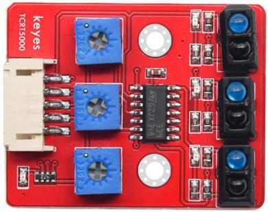|
|5|电机连接板A|1||
|6|电机连接板B|1||
|7|避障传感器|2||
|8|HC-SR04超声波传感器|1|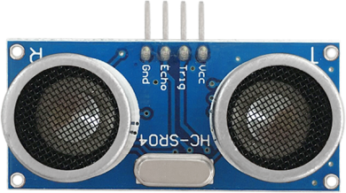|
|9|DX-BT24 蓝牙模块|1||
|10|小功放声音模块|1||
|11|XH2.54转PH2.0 5P连接线|1||
|12|HX-2.54 4P 双头 连接线|1||
|13|HX-2.54 3P 连接线|3||
|14|XH2.54-3Pin连接线|1||
|15|双头JST-PH2.0MM-2P 连接线|2||
|16|18650电池盒|1||
|17|4节5号带线电池盒|1||
|18|M1.6*10MM 圆头 十字|6||
|19|M1.6 304 不锈钢|6||
|21|M2*10MM 圆头 十字|6||
|21|M2 镀镍|6||
|22|M3*12MM 圆头 十字|10||
|23|M3*6MM 圆头|24||
|24|M3*10MM 平头|4||
|25|M3 镀镍|25||
|26|M2 304 平垫|6||
|27|双通M3*40MM|4||
|28|单通 M3*5+6MM|2||
|29|双通M3*10MM|4||
|30|单通M3*8+6MM|2||
|31|橡胶轮子|2||
|32|N20电机 支架|2||
|33|智能车亚克力板 蓝色透明2片 黄色透明1片 厚度3MM|1||
|34|螺丝刀|1||
|35|USB线|1||
|36|W420钢珠万向轮|1||
|37|遥控器|1||
|38|草帽LED|1||
|39|3Pin 双母头杜邦线|2||
|40|黑色 扎带|6||
|41|螺丝刀|1||

# 桌面迷你智能车安装

安装1

安装所需零件

分步安装1（亚克力板字面朝下）

1
完成

分步安装2

完成

安装2

安装所需零件

分步安装1

1
完成

分步安装2

2
完成

分步安装3

完成

安装3

安装所需零件

分步安装1 

1
完成

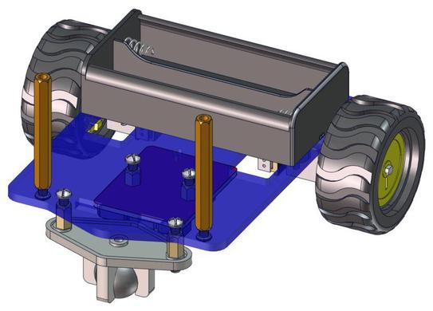

分步安装2

完成

安装4

安装所需零件

安装

完成
 
安装5

安装所需零件

分步安装1（字面朝上）

1
完成

分步安装2

2
完成

分步安装3

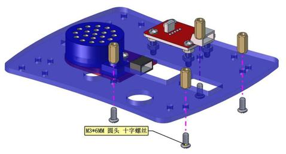

完成

安装6

安装所需零件

安装

完成

安装7

安装所需零件

安装

完成

安装8

安装所需零件

需先给功放模块插线

安装

完成

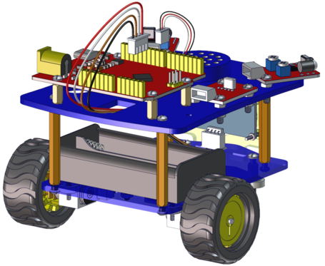

安装9

安装所需零件

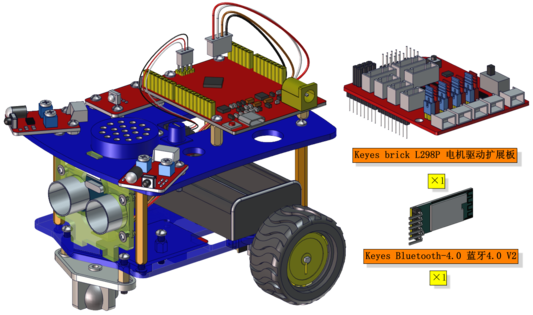

安装

完成

 接线图

电机B接线图

功放模块接线图

红外接收传感器接线图

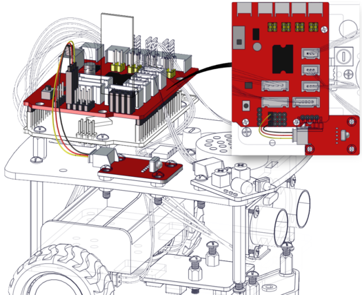

循迹传感器接线图

避障传感器1接线图

避障传感器2接线图

超声波接线图

电源接线图

完成效果图

# 开始学习 Arduino

安装Arduino IDE

我们先到arduino官方的网站<https://www.arduino.cc/>下载最新版本的arduino开发软件,进入网站之后点击界面上的SOFTWARE,，选择DOWNLOADS进入下载页面，如下图：

Arduino 软件有很多版本，有wodows,mac linux系统的（如下图），而且还有过去老的版本，你只需要下载一个适合系统的版本。

这里我们以WINDOWS系统的为例给大家介绍一下下载和安装的步骤。

WINDOWS系统的也有两个版本，一个版本是安装版的，一个是下载版的不用安装，直接下载文件到电脑，解压缩就可以用了。

两个版本都可以正常使用，看你自己的喜好了。选择一个版本，然后将Arduino
开发软件下载到我们的电脑。

一般情况下，我们点击JUST DOWNLOAD就可以下载了。

开发板简介

说明

在开始所有的项目之前，我们首先要了解下面这片arduino uno Plus开发板，因为这个智能家居的核心就是这个开发板。

UNO Plus开发板是我们最新推出的一款易用型开源控制器，硬件上与Arduino UNO相比并没有大的变动。外观上我们将蓝色换成了红色，给你们一种新的体验。硬件上，我们用ATMEGA328P-AU代替了8U2，使用type-c接口，外观美观正反面都可以接。

规格参数

|微控制器|ATmega328P-PU|
|-|-|
|工作电压|5V|
|外接电压端口输入电压|DC7-12V|
|数字引脚|14 (D0-D13) (其中包含6个PWM输出口)|
|PWM引脚|6 个(D3, D5, D6, D9, D10, D11)|
|模拟输入引脚|6 个(A0-A5)|
|每个I / O引脚的直流电流|20 mA|
|3.3V引脚的直流电流|50 mA|
|5V引脚的直流电流|最大2A|
|Flash Memory|32 KB（其中引导程序使用0.5 KB）|
|SRAM|2 KB (ATmega328P-PU)|
|EEPROM|1 KB (ATmega328P-PU)|
|时钟频率|16 MHz|
|LED按键|D13|

各个接口和主要元件说明

  
串口通信接口：D0为RX、D1为TX

PWM接口（脉宽调制）：D3 D5 D6 D9 D10 D11

外部中断接口：D2(中断0)和D3 (中断1)

SPI通信接口：D10为SS、D11为MOSI、D12为MISO、D13为SCK

IIC通信端口：A4为SDA、A5为SCL

安装开发板驱动文件

接下来，我们将介绍开发板的驱动程序安装。
在不同的计算机系统中，驱动程序的安装可能略有不同。
因此，下面我们继续在WIN 7系统中安装驱动程序。Arduino文件夹包含Arduino程序本身和驱动程序，这些驱动程序允许Arduino通过USB电缆连接到您的计算机。
在我们启动Arduino软件之前，您将需要安装USB驱动程序。

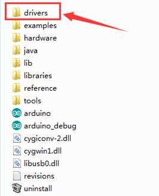

将USB先的一端插入Arduino，另一端插入计算机上的USB插座。
第一次将开发板连接到计算机时，右键单击“计算机”图标-\>“属性”-\>单击“设备管理器”，在“其他设备”下，您应看到“
未知设备”旁边带有一个黄色警告三角形。 这是您的Arduino。

然后右键单击设备，然后选择顶部菜单选项（更新驱动程序软件...），如下图所示。

然后将提示您“自动搜索更新的驱动程序软件”或“浏览我的计算机以获取驱动程序软件”。
如下图所示。 在此页面中，选择“浏览我的计算机以获取驱动程序软件”。

之后，选择浏览器选项并导航到Arduino安装的“ drivers”文件夹。

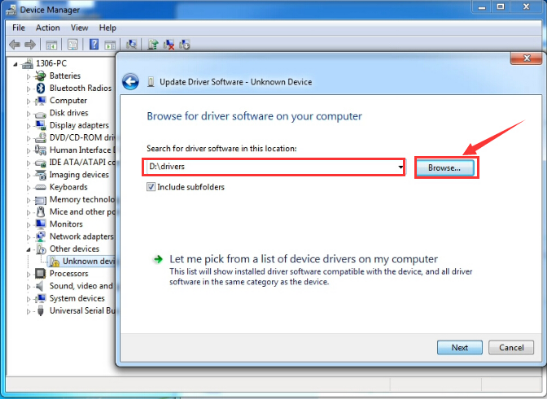

单击“下一步”，您可能会收到安全警告，如果这样，则允许安装该软件。
如下图所示。

安装软件后，您将收到确认消息。 安装完成后，单击“关闭”。

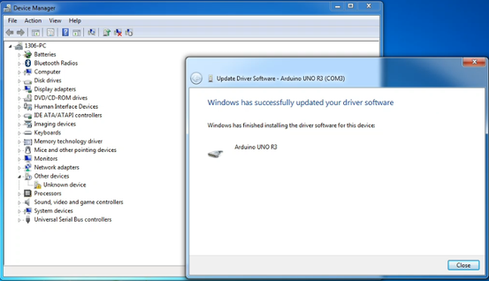

现在驱动程序已经安装好。
然后您可以右键单击“计算机”-\>“属性”-\>“设备管理器”，您将看到如下图所示的设备。

Arduino IDE设置和工具栏介绍

装好了开发板的驱动，我们下面要了解Arduino开发软件的使用了，首先我们点击电脑桌面上的图标，打开Arduino IDE。

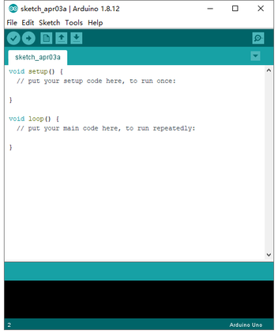

为了避免在将程序上载到板上时出现任何错误，必须选择正确的Arduino板名称，该名称与连接到计算机的电路板相匹配。转到Tools→Board，然后选择你的板。

然后再选择正确的COM口（安装驱动成功后可看到对应COM口）。

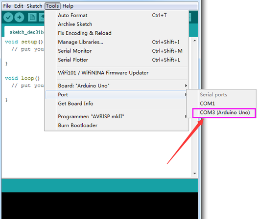

我们的程序上传到板之前，我们必须演示Arduino IDE工具栏中出现的每个符号的功能。

A - 用于检查是否存在任何编译错误。

B - 用于将程序上传到Arduino板。

C - 用于创建新草图的快捷方式。

D - 用于直接打开示例草图之一。

E - 用于保存草图。

F - 用于从板接收串行数据并将串行数据发送到板的串行监视器。

启动你的第一个程序

上面我们学习了怎么下载软件和安装开发板的驱动，那下面我们就开始正式开始第一个程序，打开文件选择例子，选择第一个文件BASIC里面的BLINK程序

按照前面方法设置板和COM口，IDE右下角显示对应板和COM口。

点击图标开始编译程序，检查错误，检查无误。

点击点击图标开始上传程序，上传成功。

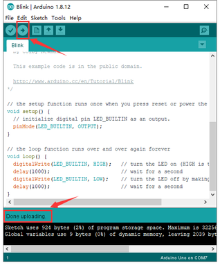

程序上传成功，板载的LED灯亮一秒钟，灭一秒钟，恭喜你的第一个程序完成了！

# 桌面迷你智能车课程

传感器模块课程

## 第1课 LED灯 

项目介绍：

前面我们安装了keyes UNO R3开发板的驱动。接下来的项目我们就要由简单到复杂，一步一步探索Arduino的世界了。首先我们要来完成经典的“Arduino点亮LED”，也就是Blink项目。Blink对于学习Arduino的爱好者而言，是最基础的项目是新手必须经历的一个练习。

LED
，发光二极管的简称。由含镓（Ga）、砷（As）、磷（P）、氮（N）等的化合物制成。当电子与空穴复合时能辐射出可见光，因而可以用来制成发光二极管。在电路及仪器中作为指示灯，或者组成文字或数字显示。

为了实验的方便，我们将LED发光二极管做成了一个模块，在第一个项目中，我们用一个最基本的测试代码来控制LED，亮一秒钟，灭一秒钟，来实现闪烁的效果。你可以改变代码中LED灯亮灭的时间，实现不同的闪烁效果。LED模块信号端S为高电平时LED亮起，S为低电平时LED熄灭。

LED模块参数：

控制接口: 数字口

工作电压: DC 3.3-5V

排针间距: 2.54mm

LED显示颜色：红色

项目组件：

|控制板 * 1|Keyes brick L298P 电机驱动扩展板 V1*1|keyes 草帽LED白发红模块*1|
|-|-|-|
||||
|USB线*1|3Pin 双母头杜邦线*1|18650双节电池盒*1|18650电池*2 （电池自配）|
||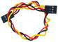||

接线图：

由上图我们可以看到，扩展板是堆叠在开发板上的，LED模块的-接到了扩展板的G,LED模块的+接到了扩展板的5V，LED模块的S已经接到了扩展板上的D9接口，接好线之后我们开始编写代码：

项目代码：

/\*

keyes 桌面迷你智能车

lesson 1.1

LED闪烁

http://www.keyes-robot.com

\*/

void setup()

{

pinMode(9, OUTPUT);// 将数字引脚9初始化为输出

}

void loop() // 循环功能

{

digitalWrite(9, HIGH); // 点亮LED

delay(1000); // 等待一秒钟

digitalWrite(9, LOW); // 熄灭LED

delay(1000); // 等待一秒钟

}

//\*\*\*\*\*\*\*\*\*\*\*\*\*\*\*\*\*\*\*\*\*\*\*\*\*\*\*\*\*\*\*\*\*\*\*\*\*\*\*\*\*\*\*\*\*\*\*\*\*\*\*\*\*\*\*\*\*\*\*\*\*\*\*\*\*\*\*

项目结果：

点击上传程序，你应该看到D9脚接着的LED打开和关闭，而且间隔的时间是一秒钟。

代码说明:

pinMode(9，OUTPUT) -
在使用Arduino的引脚之前，你需要告诉开发板它是INPUT还是OUTPUT。我们使用一个内置的“函数”pinMode()来做到这一点。

digitalWrite(9，HIGH) -
当使用引脚作为OUTPUT时，可以将其命令为HIGH（输出5伏）或LOW（输出0伏）。

项目拓展：

前面我们控制了LED模块亮1秒钟,灭一秒钟
，现在我们来拓展一下思路，通过改变delay的时间来改变LED 灯闪烁的频率。

代码如下:

/\*

keyes 桌面迷你智能车

lesson 1.2

LED闪烁

http://www.keyes-robot.com

\*/

void setup()

{

pinMode(9, OUTPUT);// 将数字引脚9初始化为输出

}

void loop() // 循环功能

{

digitalWrite(9, HIGH); // 点亮LED

delay(100); // 等待0.1秒钟

digitalWrite(9, LOW); // 熄灭LED

delay(100); // 等待0.1秒钟

}

//\*\*\*\*\*\*\*\*\*\*\*\*\*\*\*\*\*\*\*\*\*\*\*\*\*\*\*\*\*\*\*\*\*\*\*\*\*\*\*\*\*\*\*\*\*\*\*\*\*\*\*\*\*\*\*\*\*\*\*\*\*\*\*\*\*\*\*

怎么样是不是很好理解，就是通过改变delay
这个代码的时间，来改变3脚LED亮和灭的频率，不多说，我们上传代码。看看这个LED灯闪烁的频率是不是比之前快了？

## 第2课 LED 亮度的调节 

项目介绍：

前面课程中，我们详细的介绍了通过代码控制LED亮灭，实现闪烁的效果。这节课我们使用PWM来控制LED亮度不断地变化，模拟我们呼吸的效果。

PWM是使用数字手段来控制模拟输出的一种手段。使用数字控制产生占空比不同的方波（一个不停在高电平与低电平之间切换的信号)来控制模拟输出。一般来说端口的输入电压只有两个0V与5V。如果想要改变灯的亮度怎么办呢个？有同学说串联电阻，对，这个方法是正确的。但是，如果想要得到不同的亮度，且在不同亮度之间来回变动怎么办呢？不可能不停地切换电阻吧。这种情况下就需要使用PWM了，那它是怎么控制的呢？

对于Arduino的数字端口电压输出只有LOW与HIGH两个，对应的就是0V与5V的电压输出，可以把LOW定义为0，HIGH定义为1，1秒内让Arduino输出500个0或者1的信号。如果这500个全部为1，那就是完整的5V，如果全部为0，那就是0V。如果010101010101这样输出，刚好一半，端口输出的平均电压就为2.5V了。这个和放映电影是一个道理，咱们所看的电影并不是完全连续的，它其实是每秒输出25张图片。在这种情况下，人的肉眼是分辨不出来的，看上去就是连续的了。PWM也是同样的道理，如果想要不同的电压，就控制0与1的输出比例控制就可以了。当然这和真实的连续输出还是有差别的，单位时间内输出的0,1信号越多，控制的就越精确。

项目组件：

|控制板 * 1|Keyes brick L298P 电机驱动扩展板 V1*1|keyes 草帽LED白发红模块*1||
|-|-|-|-|
||||
|USB线*1|3Pin 双母头杜邦线*1|18650双节电池盒*1|18650电池*2 （电池自配）|
||||

接线图：

Arduino的PWM引脚在3，5，6，9，10，11,上一小节的接线刚刚好在9脚，所以我们这个接线不用变

项目代码：

我们来看Arduino代码:

/\*

keyes 桌面迷你智能车

lesson 2.1

呼吸灯

http://www.keyes-robot.com

\*/

int ledPin = 9; // 定义LED接口为数字口9

int value;

void setup () {

pinMode (ledPin, OUTPUT); // 初始化led引脚为输出模式

}

void loop () {

for (value = 0; value \< 255; value = value + 1) {

analogWrite (ledPin, value); //LED变量

delay (5); // 延迟5ms

}

for (value = 255; value \> 0; value = value - 1) {

analogWrite (ledPin, value); // LED变暗

delay (5); // 延迟5ms

}

}

项目结果：

代码下载完成后，我们可以看到LED会有个逐渐由亮到灭的一个缓慢过程，而不是直接的亮灭，如同呼吸一般，均匀变化。

代码说明:

当我们需要重复执行某句话时，我们可以使用for语句。

for语句格式如下：

for循环顺序如下：

第一轮：1 → 2 → 3 → 4

第二轮：2 → 3 → 4

…

直到2不成立，for循环结束。

知道了这么个顺序之后，回到代码中：

for (int value = 0; value \< 255; value=value+1){

...}

for (int value = 255; value \>0; value=value-1){

...}

这两个for语句实现了value的值不断由0增加到255，随之在从255减到0，在增加到255……,无限循环下去。

再看下for里面，涉及一个新函数analogWrite()。

我们知道数字口只有0和1两个状态，那如何发送一个模拟值到一个数字引脚呢？就要用到该函数。观察一下Arduino板，查看数字引脚，你会发现其中6个引脚旁标有“~”，这些引脚不同于其他引脚，它们可以输出PWM信号。

函数格式如下：

analogWrite(pin,value)

analogWrite()函数用于给PWM口写入一个0~255的模拟值。所以，value是在0~255之间的值。特别注意的是，analogWrite()函数只能写入具有PWM功能的数字引脚，也就是3，5，6，9，10，11引脚。

PWM是一项通过数字方法来获得模拟量的技术。数字控制来形成一个方波，方波信号只有开关两种状态（也就是我们数字引脚的高低）。通过控制开与关所持续时间的比值就能模拟到一个0到5V之间变化的电压。开（学术上称为高电平）所占用的时间就叫做脉冲宽度，所以PWM也叫做脉冲宽度调制。

通过下面五个方波来更形象的了解一下PWM。

PWM示意图

上图绿色竖线代表方波的一个周期。每个analogWrite(value)中写入的value都能对应一个百分比，这个百分比也称为占空比(Duty Cycle)，指的是高电平在周期内占的时间比值，也就是：占空比=高电平时间 /
周期时间。图中，从上往下，第一个方波，占空比为0%，对应的value为0。LED亮度最低，也就是灭的状态。高电平持续时间越长，也就越亮。所以，最后一个占空比为100%的对应value是255，LED最亮。50%就是最亮的一半了，25%则相对更暗。

PWM比较多的用于调节LED灯的亮度。或者是电机的转动速度，电机带动的车轮速度也就能很容易控制了，在玩一些Arduino机器人时，更能体现PWM的好处。

项目拓展：

我们不改变灯的脚位，只是改变程序里面delay的值，看看它如何改变渐变效果。

/\*

keyes 桌面迷你智能车

lesson 2.2

呼吸灯

http://www.keyes-robot.com

\*/

int ledPin = 9; // 定义LED接口为数字口9

void setup () {

pinMode (ledPin, OUTPUT); // 初始化led引脚为输出模式

}

void loop () {

for (int value = 0; value \< 255; value = value + 1) {

analogWrite (ledPin, value); //LED变量

delay (30); // 延迟30ms

}

for (int value = 255; value \> 0; value = value - 1) {

analogWrite (ledPin, value); // LED变暗

delay (30); // 延迟30ms

}

}

//\*\*\*\*\*\*\*\*\*\*\*\*\*\*\*\*\*\*\*\*\*\*\*\*\*\*\*\*\*\*\*\*\*\*\*\*\*\*\*\*\*\*\*\*\*\*\*\*\*\*\*\*\*\*\*\*\*\*

上传代码到开发板，看LED渐变的效果是不是慢了一些。

## 第3课 蜂鸣器模块实验 

项目介绍：

用Arduino可以完成的互动作品有很多，最常见也最常用的就是声光展示了，前面一直都是在用LED做实验，本实验就设计电路发出声音，能够发出声音最常见的元器件就是蜂鸣器和喇叭，两者相比较蜂鸣器更简单和易用，可蜂鸣器又分有源蜂鸣器和无源蜂鸣器，我们在本实验中采用的是无源蜂鸣器。

在套件中包含一个功放模块，它主要由一个无源蜂鸣器和一个放大电路组成。使用时我们可以在模块信号端输入不同频率的方波，控制蜂鸣器响起不同的声音。同时，我们可以通过旋转功放模块上的电位器，调节声音放大倍数，也就是调节声音的大小。在这一课程中，我们通过代码控制蜂鸣器发声，从最简单的发出某一频率声音，到让蜂鸣器发出do re mi fa so la si do声音，最后，让蜂鸣器播放特定的歌曲。

模块参数：

3.  项目组件：

|控制板 * 1|Keyes brick L298P 电机驱动扩展板 V1*1|HX-2.54 3P 双头连接线*1|
|-|-|-|
||||
|USB线*1|keyes brick 功放模块*1|18650双节电池盒*1|18650电池*2 （电池自配）|
||||

接线图：

接线注意：无源蜂鸣器模块的G、V、S引脚分别连接到扩展板上的G、V、D3，连接好电源。

项目代码：

/\*

keyes 桌面迷你智能车

lesson 3.1

蜂鸣器

http://www.keyes-robot.com

\*/

int beeppin = 3; //定义蜂鸣器引脚为D3

void setup() {

pinMode(beeppin, OUTPUT); //设置buzzer为输出模式

}

void loop() {

for (int i = 0; i \< 100; i++) { //1ms方波驱动输出一个频率的声音

digitalWrite(beeppin, HIGH);

delay(1);

digitalWrite(beeppin, LOW);

delay(1);

}

for (int i = 0; i \< 100; i++) { //2ms方波驱动输出另一个频率的声音

digitalWrite(beeppin, HIGH);

delay(2);

digitalWrite(beeppin, LOW);

delay(2);

}

}

//\*\*\*\*\*\*\*\*\*\*\*\*\*\*\*\*\*\*\*\*\*\*\*\*\*\*\*\*\*\*\*\*\*\*\*\*\*\*\*\*\*\*\*\*\*\*\*\*\*\*\*\*\*\*\*\*\*\*\*\*\*\*\*\*\*\*\*\*\*\*\*\*\*\*\*\*

项目结果：

在UNO R3板上上传代码成功，按照接线图上电后，拨码开关拨打到“ON”端。上传代码完成后，蜂鸣器循环响起两种不同频率的声音；上传扩展代码，蜂鸣器循环响起《欢乐颂》歌曲。旋转功放模块上电位器，可以调节声音的大小。

项目拓展：

从上面的实验看，如果我们能够控制好频率和节拍，那就有可能演奏出动听的音乐。因此，我们首先需要搞清楚各音调的频率，具体见下表：

低音：

|音调 音符|1#|2#|3#|4#|5#|6#|7#|
|-|-|-|-|-|-|-|-|
|A|221|248|278|294|330|371|416|
|B|248|278|294|330|371|416|467|
|C|131|147|165|175|196|221|248|
|D|147|165|175|196|221|248|278|
|E|165|175|196|221|248|278|312|
|F|175|196|221|234|262|294|330|
|G|196|221|234|262|294|330|371|

中音：

|音调 音符|1|2|3|4|5|6|7|
|-|-|-|-|-|-|-|-|
|A|441|495|556|589|661|742|833|
|B|495|556|624|661|742|833|935|
|C|262|294|330|350|393|441|495|
|D|294|330|350|393|441|495|556|
|E|330|350|393|441|495|556|624|
|F|350|393|441|495|556|624|661|
|G|393|441|495|556|624|661|742|

高音：

|音调 音符|1#|2#|3#|4#|5#|6#|7#|
|-|-|-|-|-|-|-|-|
|A|882|990|1112|1178|1322|1484|1665|
|B|990|1112|1178|1322|1484|1665|1869|
|C|525|589|661|700|786|882|990|
|D|589|661|700|786|882|990|1112|
|E|661|700|786|882|990|1112|1248|
|F|700|786|882|935|1049|1178|1322|
|G|786|882|990|1049|1178|1322|1484|

我们知道了音调的频率后，下一步就是控制音符的演奏时间。每个音符都会播放一定的时间，这样才能构成一首优美的曲子，而不是生硬的一个调的把所有的音符一股脑的都播放出来。音符节奏分为一拍、半拍、1/4拍、1/8拍，我们规定一拍音符的时间为1；半拍为0.5；1/4拍为0.25；1/8拍为0.125……，所以我们可以为每个音符赋予这样的拍子播放出来，音乐就成了。

这里我们具体以《欢乐颂》为例：

从简谱看，该音乐是D调的，这里的各音符对应的频率对应的是上表中D调的部分。另外，该音乐为四分之四拍，每个对应为1拍。几个特殊音符说明如下：

第一，普通音符。如第一个音符3，对应频率350，占1拍。

第二，带下划线音符，表示0.5拍。

第三，有的音符后带一个点，表示多加0.5拍，即1+0.5

第四，有的音符后带一个—，表示多加1拍，即1+1

第五，有的两个连续的音符上面带弧线，表示连音，可以稍微改下连音后面那个音的频率，比如减少或增加一些数值（需自己调试），这样表现会更流畅，其实不做处理，影响也不大。

下面，看具体代码：

/\*

keyes 桌面迷你智能车

lesson 3.2

蜂鸣器播放音乐

http://www.keyes-robot.com

\*/

\#define D0 -1

\#define D1 262

\#define D2 293

\#define D3 329

\#define D4 349

\#define D5 392

\#define D6 440

\#define D7 494

\#define M1 523

\#define M2 586

\#define M3 658

\#define M4 697

\#define M5 783

\#define M6 879

\#define M7 987

\#define H1 1045

\#define H2 1171

\#define H3 1316

\#define H4 1393

\#define H5 1563

\#define H6 1755

\#define H7 1971

//列出全部D调的频率

\#define WHOLE 1

\#define HALF 0.5

\#define QUARTER 0.25

\#define EIGHTH 0.25

\#define SIXTEENTH 0.625

//列出所有节拍

int tune\[\] = //根据简谱列出各频率

{

M3, M3, M4, M5,

M5, M4, M3, M2,

M1, M1, M2, M3,

M3, M2, M2,

M3, M3, M4, M5,

M5, M4, M3, M2,

M1, M1, M2, M3,

M2, M1, M1,

M2, M2, M3, M1,

M2, M3, M4, M3, M1,

M2, M3, M4, M3, M2,

M1, M2, D5, D0,

M3, M3, M4, M5,

M5, M4, M3, M4, M2,

M1, M1, M2, M3,

M2, M1, M1

};

float durt\[\] = //根据简谱列出各节拍

{

1, 1, 1, 1,

1, 1, 1, 1,

1, 1, 1, 1,

1 + 0.5, 0.5, 1 + 1,

1, 1, 1, 1,

1, 1, 1, 1,

1, 1, 1, 1,

1 + 0.5, 0.5, 1 + 1,

1, 1, 1, 1,

1, 0.5, 0.5, 1, 1,

1, 0.5, 0.5, 1, 1,

1, 1, 1, 1,

1, 1, 1, 1,

1, 1, 1, 0.5, 0.5,

1, 1, 1, 1,

1 + 0.5, 0.5, 1 + 1,

};

int length;

int tonepin = 3; //用3号接口

void setup()

{

pinMode(tonepin, OUTPUT);

length = sizeof(tune) / sizeof(tune\[0\]); //计算长度

}

void loop()

{

for (int x = 0; x \< length; x++)

{

tone(tonepin, tune\[x\]);

delay(500 \* durt\[x\]);
//这里用来根据节拍调节延时，500这个指数可以自己调整，在该音乐中，用500比较合适。

noTone(tonepin);

}

delay(2000);

}

//\*\*\*\*\*\*\*\*\*\*\*\*\*\*\*\*\*\*\*\*\*\*\*\*\*\*\*\*\*\*\*\*\*\*\*\*\*\*\*\*\*\*\*\*\*\*\*\*\*\*\*\*\*\*\*\*\*\*\*\*\*\*\*\*\*\*\*\*\*\*\*\*\*\*

上传代码到开发板，怎么样，你的欢乐女神响起了没有？

## 第4课 红外避障传感器实验 

项目介绍：

红外避障传感器模块对环境光线适应能力强，其具有一对红外线发射与接收管，发射管发射出一定频率的红外线，当检测方向遇到障碍物（反射面）时，红外线反射回来被接收管接收，经过比较器电路处理之后，绿色指示灯会亮起，同时信号输出接口输出数字信号（一个低电平信号），可通过电位器旋钮调节检测距离，有效距离范围
2～30cm，工作电压为
3.3V-5V。该传感器的探测距离可以通过电位器调节、具有干扰小、便于装配、使用方便等特点，可以广泛应用于机器人避障、避障小车、流水线计数及黑白线循迹等众多场合。我们把测试结果在串口监视器上显示，并且利用结果控制1个外接LED模块上的LED亮灭。

模块参数：

工作电压：3.3-5V（DC）

接口：3PIN接口

输出信号：数字信号

感应距离：2-40cm，检测距离可以通过电位器进行调节，

检测角度 35°

项目组件：

|控制板 * 1|Keyes brick L298P 电机驱动扩展板 V1*1|keyes 草帽LED白发红模块*1|keyes brick 避障传感器*1|
|-|-|-|-|
|||||
|HX-2.54 3P 双头连接线*1|3Pin 双母头杜邦线*1|USB线*1|18650双节电池盒*1|18650电池*2 （电池自配）|
|||||

接线图：

接线注意：用导线把左边的避障传感器连接到电机驱动扩展板上的接口（G、V、A1），右边的避障传感器连接到接口（G、V、A2），模拟口在数字口不够的情况下，模拟口也可以当数字口使用，模拟口A0相当于数字口14，A1相当于数字口15，以此类推。

项目代码：

/\*

keyes 桌面迷你智能车

lesson 4.1

避障传感器

http://www.keyes-robot.com

\*/

int l_sensorPin = A1; //定义左边避障传感器接A1

int l_val;

void setup() {

Serial.begin(9600); //设置波特率为9600

pinMode(l_sensorPin, INPUT);//将l_sensorPin设置为输入模式

}

void loop() {

l_val = digitalRead(l_sensorPin);//读取避障传感器的值

Serial.print("l_val="); //在串口打印出来

Serial.println(l_val);

}

项目结果：

实验中我们利用USB线供电，上传好测试代码，打开串口监视器，设置波特率为9600，当我们接近避障传感器时信号端输出低电平，如下图：

代码说明：

Serial.begin(9600);

代表设置波特率为9600；代码串口监视器中显示数据；

Serial.println(l_val);

代码串口监视器中显示数据，数据输出成功自动换行。

项目拓展：

/\*

keyes 桌面迷你智能车

lesson 4.2

避障传感器

http://www.keyes-robot.com

\*/

int l_sensorPin = A1;

int led = 9;

int l_val;

void setup()

{

pinMode(l_sensorPin, INPUT);

pinMode(led , OUTPUT);

}

void loop()

{

l_val = digitalRead(l_sensorPin);

if (l_val == 0)

{

digitalWrite(led, HIGH);

}

else

{

digitalWrite(led, LOW);

}

}

当传感器检测到障碍物（输出0）时，外接LED模块LED亮起，否则LED熄灭。

## 第5课 循迹传感器 

项目介绍：

循迹传感器实际上是红外传感器。 此处使用的组件是TCRT5000红外管。

其工作原理是利用红外光对颜色的不同反射率，然后将反射信号的强度转换为电流信号。

在检测过程中，黑色在高电平时处于活动状态，而白色在低电平时处于活动状态。
检测高度为0-3厘米。

KEYES三路循迹模块在一块板上集成了三个TCRT5000红外管，接线和控制更加方便。

通过旋转传感器上的可调电位器，可以调节传感器的检测灵敏度。

参数：

工作电压：3.3-5V（DC）

接口：5PIN

输出信号：数字信号

检测高度：0-3厘米

特别说明：在测试之前，请旋转传感器上的电位器以调整检测灵敏度。
当将LED调整在ON和OFF之间的阈值时，灵敏度是最好的。

项目组件：

|控制板 * 1|Keyes brick L298P 电机驱动扩展板 V1*1|keyes 草帽LED白发红模块*1|Keyes connectors 循迹传感器*1|
|-|-|-|-|
|||||
|XH2.54转PH2.0 5P 连接线*1|3Pin 双母头杜邦线*1|USB线*1|18650双节电池盒*1|18650电池*2 （电池自配）|
|||||

接线图:

循迹传感器接扩展板的D11、D7、D8引脚（左11，中7，右8）。

项目代码：

/\*

keyes 桌面迷你智能车

lesson 5.1

循迹传感器

http://www.keyes-robot.com

\*/

int L_pin = 11; //左边循迹传感器的引脚接数字口11

int M_pin = 7; //中间循迹传感器的引脚接数字口7

int R_pin = 8; //右边循迹传感器的引脚接数字口8

int val_L, val_R, val_M; // 定义三个传感器的变量值

void setup()

{

Serial.begin(9600); //启动串口监视器，并设置波特率为9600

pinMode(L_pin, INPUT); // 设置左边循迹传感器为输入模式

pinMode(M_pin, INPUT); // 设置中间循迹传感器为输入模式

pinMode(R_pin, INPUT); // 设置右边循迹传感器为输入模式

}

void loop()

{

val_L = digitalRead(L_pin);//读取左边传感器的值

val_R = digitalRead(R_pin);//读取右边传感器的值

val_M = digitalRead(M_pin);//读取中间传感器的值

Serial.print("left:");

Serial.print(val_L);

Serial.print(" middle:");

Serial.print(val_M);

Serial.print(" right:");

Serial.println(val_R);

delay(500);// 延迟500ms

}

//\*\*\*\*\*\*\*\*\*\*\*\*\*\*\*\*\*\*\*\*\*\*\*\*\*\*\*\*\*\*\*\*\*\*\*\*\*\*\*\*\*\*\*\*\*\*\*\*\*\*\*\*\*\*\*\*\*\*\*\*\*\*\*\*\*\*\*\*\*\*\*\*\*\*\*\*

项目结果：

上传代码带开发板，打开串口监视，可以看到左中右三个循迹传感器的状态，在没有接收到信号的时候，三个传感器都是高电平状态，显示的数值是1。如果我们用白纸去遮挡传感器，传感器的状态都变成了0。

代码说明：

Serial.begin(9600)-初始化串口,串口通信波特率为9600  ，

pinMode- 定义单片机PIN脚模式是输入还是输出，input是输入，output是输出，

digitalRead-读取引脚电平状态，一般有两种状态，HIGH或者LOW。

项目拓展：

上面我们了解了循迹传感器的工作原理，接下来我们在第9脚接上一个LED
灯，然后通过读取循迹传感器的状态，来控制LED的亮和灭。如下图接线：

我们开始来编写代码：

/\*

keyes 桌面迷你智能车

lesson 5.2

循迹传感器

http://www.keyes-robot.com

\*/

int L_pin = 11; //左边循迹传感器的引脚接数字口11

int M_pin = 7; //中间循迹传感器的引脚接数字口7

int R_pin = 8; //右边循迹传感器的引脚接数字口8

int val_L, val_R, val_M; // 定义三个传感器的变量值

void setup()

{

Serial.begin(9600); //启动串口监视器，并设置波特率为9600

pinMode(L_pin, INPUT); // 设置左边循迹传感器为输入模式

pinMode(M_pin, INPUT); // 设置中间循迹传感器为输入模式

pinMode(R_pin, INPUT); // 设置右边循迹传感器为输入模式

pinMode(9, OUTPUT);

}

void loop() {

val_L = digitalRead(L_pin);//读取左边传感器的值

val_R = digitalRead(R_pin);//读取右边传感器的值

val_M = digitalRead(M_pin);//读取中间传感器的值

Serial.print("left:");

Serial.print(val_L);

Serial.print(" middle:");

Serial.print(val_M);

Serial.print(" right:");

Serial.println(val_R);

if (val_L == LOW || val_M == LOW || val_R == LOW) //检测到信号

{

digitalWrite(9, HIGH);//LED 灯亮

}

else//如果没有检测到信号

{

digitalWrite(9, LOW);//LED 灯灭

}

}

上传代码到开发板，用我们的手去一个个的靠近传感器，我们看看LED灯的状态发生了改变没有？当我们用手去遮挡循迹传感器的时候，我们可以看到LED灯亮起来了。

## 第6课 超声波模块 

项目介绍：

HC-SR04超声波传感器像蝙蝠一样使用声纳来确定到物体的距离。
它提供出色的非接触范围检测，具有高精度和稳定的读数。
它带有超声波发射和接收模块。

HC-SR04或超声波传感器被广泛用于创建障碍物检测和距离测量应用以及其他各种应用的电子项目中。
在这里，我们介绍使用arduino和超声传感器测量距离的简单方法.

超声波参数：

电源：+ 5V DC

静态电流：\<2mA

工作电流：15mA

有效角度：\<15°

测距范围：2cm – 400 cm

分辨率：0.3厘米

测量角度：30度

触发输入脉冲宽度：10uS

项目组件：

|控制板 * 1|Keyes brick L298P 电机驱动扩展板 V1*1|keyes 草帽LED白发红模块*1|HC-SR04超声波传感器*1|
|-|-|-|-|
|||||
|HX-2.54 4P 双头 连接线*1|3Pin 双母头杜邦线*1|USB线*1|18650双节电池盒*1|18650电池*2 （电池自配）|
|||||

超声波模块知识：

原理：看超声波的图可知，像是有两个眼睛，其一边是发射超声的，一边是接收超声波的，然后检测从发射遇到障碍物返回被接收到所需的时间t，再根据声音在空气中的传播速度大概是343m/s,
距离 = 速度 \* 时间 ，
由于超声波发射返回是两段路程了，所以需要除以2，故超声波测到的 距离
=（速度 \* 时间）/2

超声波模块的使用方法及时序图：

1、使用GPIO引脚给SR04的Trig引脚至少10μs的高电平信号，触发SR04模块测距功能；

2、触发后，模块会自动发送8个40KHz的超声波脉冲，并自动检测是否有信号返回。这步会由模块内部自动完成。

3、如有信号返回，Echo引脚会输出高电平，高电平持续的时间就是超声波从发射到返回的时间。

超声波模块的电路图

接线图：

接线注意：超声波传感器模块的VCC引脚连接至keyestudio V5
传感器扩展板的5v(V)，Trig引脚至数字12(S)，Echo引脚至数字13(S)，Gnd引脚至Gnd(G)。

项目代码：

/\*

keyes 桌面迷你智能车

lesson 6.1

超声波传感器

http://www.keyes-robot.com

\*/

int trigPin = 12; // Trig引脚接数字口12

int echoPin = 13; // Echo引脚接数字口13

long duration, cm, inches;

void setup() {

//启动串口

Serial.begin (9600);

//定义引脚模式

pinMode(trigPin, OUTPUT);

pinMode(echoPin, INPUT);

}

void loop() {

// 拉低2us

digitalWrite(trigPin, LOW);

delayMicroseconds(2);

digitalWrite(trigPin, HIGH);//至少给trig引脚10us高电平触发

delayMicroseconds(10);

digitalWrite(trigPin, LOW);

// 读取echo高电平时间

duration = pulseIn(echoPin, HIGH);

// 转换成距离

cm = (duration / 2) / 29.1;

inches = (duration / 2) / 74;

Serial.print(inches);

Serial.print("in, ");

Serial.print(cm);

Serial.print("cm");

Serial.println();

delay(200);

}

//\*\*\*\*\*\*\*\*\*\*\*\*\*\*\*\*\*\*\*\*\*\*\*\*\*\*\*\*\*\*\*\*\*\*\*\*\*\*\*\*\*\*\*\*\*\*\*\*\*\*\*\*\*\*\*\*\*\*\*\*\*\*\*\*\*\*\*\*\*\*\*\*\*\*

项目结果：

上传好测试代码到开发板，打开串口监视器，设置波特率为9600，我们可以看到超声波模块显示的距离，单位是厘米和英寸。用手阻挡超声波模块，我们看到显示距离的数值变小了。

代码说明:

int trigPin- 这个是定义发射超声波的脚位，通常是输出，

int echoPin - 这个是定义接收超声波的脚位，通常是输入。

cm = (duration/2) / 29.1-

inches = (duration/2) / 74-

我们可以使用以下公式计算距离：

距离=（行驶时间/ 2）x声速

声音速度为：343m / s = 0.0343 cm / uS = 1 / 29.1 cm / uS

或英寸：13503.9in / s = 0.0135in / uS = 1 / 74in / uS

我们需要将传播时间除以2，因为我们必须考虑到波浪已发送，撞击物体然后返回到传感器。

项目拓展：

我们刚刚测出了超声波显示的距离，那我们动动脑筋，能不能用测出的距离来做一些控制呢，如果控制一个LED灯的亮和灭。我们来试一下，在D9脚接上一个LED灯模块。

/\*

keyes 桌面迷你智能车

lesson 6.2

超声波传感器

http://www.keyes-robot.com

\*/

int trigPin = 12; // Trig引脚接数字口12

int echoPin = 13; // Echo引脚接数字口13

long duration, cm, inches;

void setup() {

//启动串口

Serial.begin (9600);

//定义引脚模式

pinMode(trigPin, OUTPUT);

pinMode(echoPin, INPUT);

pinMode(9, OUTPUT);

}

void loop() {

// 拉低2us

digitalWrite(trigPin, LOW);

delayMicroseconds(2);

digitalWrite(trigPin, HIGH);//至少给trig引脚10us高电平触发

delayMicroseconds(10);

digitalWrite(trigPin, LOW);

// 读取echo高电平时间

duration = pulseIn(echoPin, HIGH);

// 转换成距离

cm = (duration / 2) / 29.1;

inches = (duration / 2) / 74;

Serial.print(inches);

Serial.print("in, ");

Serial.print(cm);

Serial.print("cm");

Serial.println();

if (cm \>= 2 && cm \<= 10) {//距离在2~10cm则点亮led

digitalWrite(9, HIGH);

}

else {

digitalWrite(9, LOW);//否则熄灭

}

delay(50);

}

//\*\*\*\*\*\*\*\*\*\*\*\*\*\*\*\*\*\*\*\*\*\*\*\*\*\*\*\*\*\*\*\*\*\*\*\*\*\*\*\*\*\*\*\*\*\*\*\*\*\*\*\*\*\*\*\*\*\*\*\*\*\*\*\*

上传好测试代码到开发板，我们用手去靠近超声波传感器，看LED
灯亮起来了没有。

## 第7课 红外接收原理及应用

项目介绍：

红外遥控在日常生活中随处可见，它被用来控制各种家电，如电视、音响、录影机和卫星信号接收器。红外遥控是由红外发射和红外接收系统组成的，也就是一个红外遥控器和红外接收模块和一个能解码的单片机组成的。 

红外发射的遥控器发射的38K红外载波信号是由遥控器里的编码芯片对其进行编码。它是以一段引导码，用户码，数据码，数据反码组成，利用脉冲的时间间隔来区别是0还是1信号(高电平低电平之比约为1:1时被认为是信号0)，而编码就是由这些0
、1信号组成。同一个遥控器的用户码是不变的，用数据吗不同来分辨遥控器按的键不同。当按下遥控器按键时，遥控器发送出红外载波信号，红外接收器接收到信号时程序对载波信号进行解码，通过数据码的不同来判断按下的是哪个键。单片机由接收到的01信号进行解码，由此判断遥控器按下的是什么键。

红外接收我们用的是一个红外接收模块，主要由红外接收头组成，它是集接收、放大、解调一体的器件，它内部IC就已经完成了解调，能够完成从红外线接收到输出与TTL电平信号兼容的所有工作，输出的就是数字信号。他适用于红外线遥控和红外线数据传输。接收器做成的红外接收模块只有三个引脚，信号线，VCC，GND。与arduino和其他单片机连接通信非常方便。

红外接收的参数：

工作电压：3.3-5V（DC）

接口：3PIN接口

输出信号：数字信号

接收角度：90度

频率：38khz  
接收距离：10米

右图为红外接收模块的实物图和电路图

项目组件：

|控制板 * 1|Keyes brick L298P 电机驱动扩展板 V1*1|keyes 草帽LED白发红模块*1|keyes brick 红外接收传感器*1|JMP-1 17键红外遥控*1|
|-|-|-|-|-|
||||||
|USB线*1|3Pin 双母头杜邦线*1|XH2.54-3Pin+杜邦母单*1|18650双节电池盒*1|18650电池*2 （电池自配）|
|||||

接线图：

接线注意：由于红外接收传感器输入的数字信号，将红外接收传感器模块的“-”、“+”和S引脚分别用导线连接到keyestudio传感器扩展板G（GND）、V（VCC）、A3，模拟口在数字口不够的情况下，模拟口也可以当数字口使用，模拟口A0相当于数字口14，A1相当于数字口15，以此类推。

项目代码：

在编写代码之前，要先导入红外的库文件，具体步骤请参考，（如何导入arduino库文件）这个文档。

/\*

keyes 桌面迷你智能车

lesson 7.1

红外接收

http://www.keyes-robot.com

\*/

\#include \<IRremote.h\> // IRremote库声明

int RECV_PIN = A3; //定义红外接收器的引脚为A3

IRrecv irrecv(RECV_PIN);

decode_results results; //解码结果放在 decode results结构的 result中

void setup()

{

Serial.begin(9600);

irrecv.enableIRIn(); // 启动接收器

}

void loop() {

if (irrecv.decode(&results))//解码成功，收到一组红外讯号

{

Serial.println(results.value, HEX);//以16进制换行输出接收代码

irrecv.resume(); // 接收下一个值

}

delay(100);

}

//\*\*\*\*\*\*\*\*\*\*\*\*\*\*\*\*\*\*\*\*\*\*\*\*\*\*\*\*\*\*\*\*\*\*\*\*\*\*\*\*\*\*\*\*\*\*\*\*\*\*\*\*\*\*\*

项目结果：

上传好测试代码，打开串口监视器，设置波特率为9600，拿出遥控器，对准红外接收传感器发送信号，即可看相应按键的键值，如果按键时间过长，容易出现乱码。

我们通过测试得出的数值，做了一个遥控器按键值表，方便以后使用。

代码说明：

irrecv.enableIRIn()-启动红外解码后，这时候IRrecv对象会在后台接收红外线信号。

decode()-接着就可以利用decode()函数持续检查，看看有没有解码成功。

irrecv.decode(&results)  解码成功，这个函数会返回true，并把结果放在results里面，在解码一个红外线信号之后，要运行resume()函数，这样才会持续接收下一组信号。

项目拓展：

我们刚刚解码了红外遥控器的按键值，那我们能不能用测出的按键值来做一些控制呢，如果控制一个LED灯的亮和灭。我们来试一下，在9脚接上一个LED灯模块。红外接收器的脚位不变,当有遥控器的按键按下时,接在数字引脚9上的发光LED就会点亮，再按一下按键，led熄灭，接线图如下：

/\*

keyes 桌面迷你智能车

lesson 7.2

红外接收

http://www.keyes-robot.com

\*/

\#include \<IRremote.h\>

int RECV_PIN = A3;//定义红外接收器的引脚为A3

int LED_PIN = 9; //定义发光LED引脚数字9

int a = 0;

IRrecv irrecv(RECV_PIN);

decode_results results;

void setup()

{

Serial.begin(9600);

irrecv.enableIRIn(); // 初始化红外接收器

pinMode(LED_PIN, OUTPUT); //设置发光LED引脚数字4

}

void loop() {

if (irrecv.decode(&results)) {

Serial.println(results.value, HEX);

if (results.value == 0xFF02FD & a == 0)
//由上面的键值码，我们用的遥控器上的OK键，如果按下OK键

{

digitalWrite(LED_PIN, HIGH); //LED点亮

a = 1;

}

else if (results.value == 0xFF02FD & a == 1) //再按一下

{

digitalWrite(LED_PIN, LOW); //LED熄灭

a = 0;

}

irrecv.resume(); // 接收下一个值

}

}

//\*\*\*\*\*\*\*\*\*\*\*\*\*\*\*\*\*\*\*\*\*\*\*\*\*\*\*\*\*\*\*\*\*\*\*\*\*\*\*\*\*\*\*\*\*\*\*\*\*\*\*\*\*\*\*\*\*\*\*\*\*\*\*\*\*\*\*\*\*\*\*\*\*\*\*\*\*\*\*\*\*\*

上传代码带开发板,当遥控器按下OK按键时,LED就会亮，再按一下LED就会灭,同时电脑的串口会出现按键的命令编码.

## 第8课 蓝牙遥控的原理及应用

项目介绍：

蓝牙是近几十年来最流行的一种简单的无线通信模块，易于使用，已在大多数电池供电的设备中使用。蓝牙标准进行了许多升级，以不断满足客户和技术的需求。几年来，发生了许多变化，包括数据传输速率，可穿戴设备和IoT设备以及安全系统的功耗。

在这里，我们将学习HM-10 BLE 4.0。 HM-10是一种随时可用的蓝牙4.0模块。
该模块用于建立无线数据通信。
该模块是使用德州仪器（TI）的CC2540或CC2541蓝牙低功耗（BLE）片上系统（SoC）设计的。

蓝牙参数：

蓝牙协议：蓝牙V4.0 BLE串口收发无字节限制

工作距离：在开放环境中，实现50-100m超远距离通讯

工作频率：2.4GHz ISM频段

调制方式：GFSK（高斯频移键控）

传输功率：-23dbm，-6dbm，0dbm，6dbm，可通过AT命令修改。

灵敏度：0.1％BER时≤-84dBm

传输速率：异步：6K字节； 同步：6k字节

安全功能：身份验证和加密

支持服务：中央和外围UUID FFE0，FFE1

功耗：自动休眠模式，待机电流400uA〜800uA，传输期间为8.5mA。

电源：5V DC

工作温度：–5至+65摄氏度

项目组件：

|控制板 * 1|Keyes brick L298P 电机驱动扩展板 V1*1|keyes 草帽LED白发红模块*1|BT-24蓝牙*1|
|-|-|-|-|
|||||
|3Pin 双母头杜邦线*1|USB线*1|18650双节电池盒*1|18650电池*2 （电池自配）|
||||

接线图：

蓝牙是直接插在电机驱动扩展板上的，注意一下方向，而且在上传代码之前不要插上蓝牙。

项目代码：

/\*

keyes 桌面迷你智能车

lesson 8.1

蓝牙接收

http://www.keyes-robot.com

\*/

char ble_val; //字符变量，用于存放蓝牙接收到的值

void setup() {

Serial.begin(9600);

}

void loop() {

if (Serial.available() \> 0) //判断串口缓存区是否有数据

{

ble_val = Serial.read(); //读取串口缓存区的数据

Serial.println(ble_val); //打印出来

}

}

//\*\*\*\*\*\*\*\*\*\*\*\*\*\*\*\*\*\*\*\*\*\*\*\*\*\*\*\*\*\*\*\*\*\*\*\*\*\*\*\*\*\*\*\*\*\*\*\*\*\*\*\*\*\*\*\*\*\*\*\*\*\*\*\*\*\*\*\*\*\*

（上传代码之前不要连接蓝牙模块，因为代码的上传也是用的串口通信，跟蓝牙的串口通信会有冲突，导致代码上传不成功）

上传代码到开发板，然后再插上蓝牙模块，等待手机发出的指令。

下载蓝牙测试APP：

刚刚的代码是读取串口的接收到的信号，那么我们还需要一个能够发出信号的东西，我们项目中就用手机来发送字符，蓝牙接收到手机软件发出的字符信号，在开发板的串口打印出来。我们还要在手机上下载一个APP。

1\. 苹果手机下载APP 方法：

首先到苹果的应用商店APP STORE, 搜索 BLE Scammer 4.0,
找到这个应用，然后下载到手机

2\. 安卓手机下载APP 方法

首先到谷歌的应用商店, 搜索 BLE Scanner 找到这个应用，然后下载到手机

3.安装完成后，打开应用程序并启用“位置和蓝牙”权限。

4.苹果的手机和安卓系统的使用方法几乎一样，我们这里以苹果手机作为例子讲解一下APP的使用。

5.打开手机，扫描蓝牙设备，蓝牙BLE 4.0的名称为HMSoft。蓝牙4.0没有配对密码。因此，点击connect连接到蓝牙，则可以开始使用它。

5.在完成与HMSoft的连接后，单击它，您将获得许多选项，如设备信息，通用访问权限，通用属性，自定义服务。
在所有这些选项中，单击“定制服务”。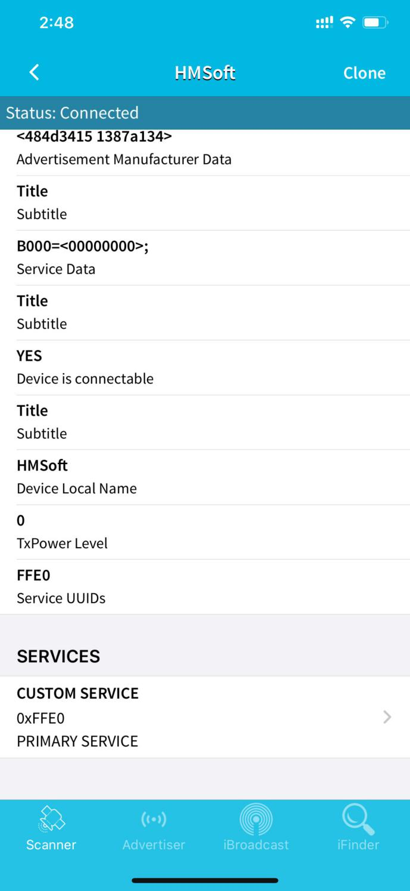

6.选择了定制服务后，出现这样的一个界面

7.  点击蓝色的（Read,Notify,WriteWithoutResponse),进入到下面这个界面

8.  点击Write Value,出现输入HEX     或者Text的界面

9\.
打开Arduino开发软件上的串口监测，我们在Text的界面输入一个0或者其他的字符

然后点击Write,看看串口监测是不是收到0的信号。

代码说明：

Serial.available()
的意思是：返回串口缓冲区中当前剩余的字符个数。一般用这个函数来判断串口的缓冲区有无数据，当Serial.available()\>0时，说明串口接收到了数据，可以读取；

Serial.read()指从串口的缓冲区取出并读取一个Byte的数据，比如有设备通过串口向Arduino发送数据了，我们就可以用Serial.read()来读取发送的数据。

项目拓展：

上面的项目，我们讲解了蓝牙接收到手机发送的信号并且在开发板的串口显示出来，那接下来我们就要想一下了，我们可以利用接收到的信号去做一些事情吗，答案是肯定的，我们这里就利用手机发送的命令去打开或者关闭一个LED灯。看接线图，在D9脚接了一个LED，

/\*

keyes 桌面迷你智能车

lesson 8.2

蓝牙控制LED

http://www.keyes-robot.com

\*/

int ledpin = 9;

void setup()

{

Serial.begin(9600);

pinMode(ledpin, OUTPUT);

}

void loop()

{

int i;

if (Serial.available())

{

i = Serial.read();

Serial.println("DATA RECEIVED:");

if (i == 1)

{

digitalWrite(ledpin, HIGH);

Serial.println("led on");

}

if (i == 0)

{

digitalWrite(ledpin, LOW);

Serial.println("led off");

}

}

}

//\*\*\*\*\*\*\*\*\*\*\*\*\*\*\*\*\*\*\*\*\*\*\*\*\*\*\*\*\*\*\*\*\*\*\*\*\*\*\*\*\*\*\*\*\*\*\*\*\*\*\*\*\*\*\*\*\*\*\*\*\*\*\*\*\*\*\*\*\*\*\*\*\*

点击手机APP
上的Write并发送1或和0以控制LED。当您发送\`\`1''时，LED将打开，而当您发送\`\`0''时，LED将关闭。

## 第9课 电机的驱动和调速 

项目介绍：

驱动电机的方法有很多，我们这个智能车用到的是最常用的L298P这个方案，
L298P是ST意法半导体公司出品的优秀大功率电机专用驱动芯片，可直接驱动直流电机、二相、四相步进电机，驱动电流达2A，电机输出端采用8只高速肖特基二极管作为保护。

我们根据L298P的电路设计了一款扩展板，叠层的设计可直接插接到开发板上使用，降低了用户使用和驱动电机的技术难度。我们来看一下这个板子的电路图和示意图：

为了调节小车上的4个电机，使得电机电机的驱动方向与后续的课程代码描述一致。驱动板上自带8个跳线帽，也可用于控制电机转向，例如当MA电机接口前方2个跳线帽由横向连接改为纵向连接时，MA电机的转动方向就和原来的转动方向相反。

规格参数：

逻辑部分输入电压：DC 5V

驱动部分输入电压：DC 7-12V

逻辑部分工作电流：\<36mA

驱动部分工作电流：\<2A

最大耗散功率：25W（T=75℃）

控制信号输入电平：高电平2.3V\<Vin\<5V  ，低电平-0.3V\<Vin\<1.5V  
工作温度：-25＋130℃

驱动小车运行原理：

根据上面电机驱动板的电路图和示意图，我们知道了A电机的方向引脚在D2,调速引脚在D6,B电机的方向引脚在D4，调速引脚在D5，按照以下表格的运动逻辑，我们就可以知道如何通过控制数字口，PWM口控制2个电机转动，从而实现智能小车的行走。其中PWM值范围为0-255，设置数字越大，电机转动越快。（左边B电机，右边A电机）

||D2|D6（PWM）|电机（A）|D4|D5（PWM）|电机（B）|
|-|-|-|-|-|-|-|
|前进|HIGH|200|正转|HIGH|200|正转|
|后退|LOW|200|反转|LOW|200|反转|
|右旋转|LOW|200|反转|HIGH|200|正转|
|左旋转|HIGH|200|正转|LOW|200|反转|
|停止|/|0|停止|/|0|停止|

项目组件：

|控制板 * 1|Keyes brick L298P 电机驱动扩展板 V1*1|Keyestudio quick connectors 12FN20电机连接板A*1|Keyestudio quick connectors 12FN20电机连接板B*1|
|-|-|-|-|
||||
|双头JST-PH2.0MM-2P*2|USB线|18650双节电池盒*1|18650电池*2 （电池自配）|
||||

接线图：

项目代码：

/\*

keyes 桌面迷你智能车

lesson 9.1

电机驱动

http://www.keyes-robot.com

\*/

int MA = 2; //定义电机A方向控制引脚为D2

int PWMA = 6; //定义电机A速度控制引脚为D6

int MB = 4; //定义电机B方向控制引脚为D4

int PWMB = 5; //定义电机B速度控制引脚为D5

void setup() {

pinMode(MA, OUTPUT); //配置电机引脚为输出模式

pinMode(PWMA, OUTPUT);

pinMode(MB, OUTPUT);

pinMode(PWMB, OUTPUT);

}

void loop() {

//前进1秒

digitalWrite(MA, HIGH); //电机A正转

analogWrite(PWMA, 200); //电机A速度为200

digitalWrite(MB, HIGH); //电机B正转

analogWrite(PWMB, 200); //电机B速度为200

delay(1000);

//后退1秒

digitalWrite(MA, LOW); //电机A反转

analogWrite(PWMA, 200); //电机A速度为200

digitalWrite(MB, LOW); //电机B反转

analogWrite(PWMB, 200); //电机B速度为200

delay(1000);

//左转1秒

digitalWrite(MA, HIGH); //电机A正转

analogWrite(PWMA, 200); //电机A速度为200

digitalWrite(MB, LOW); //电机B反转

analogWrite(PWMB, 200); //电机B速度为200

delay(1000);

//右转1秒

digitalWrite(MA, LOW); //电机A反转

analogWrite(PWMA, 200); //电机A速度为200

digitalWrite(MB, HIGH); //电机B正转

analogWrite(PWMB, 200); //电机B速度为200

delay(1000);

//停止1秒

analogWrite(PWMA, 0);

analogWrite(PWMB, 0);

delay(1000);

}

//\*\*\*\*\*\*\*\*\*\*\*\*\*\*\*\*\*\*\*\*\*\*\*\*\*\*\*\*\*\*\*\*\*\*\*\*\*\*\*\*\*\*\*\*\*\*\*\*\*\*\*\*\*\*\*\*\*\*\*\*\*\*\*\*\*\*\*\*\*\*\*

项目结果：

上传代码成功，上电后，智能车前进1秒，后退1秒，左转1秒，右转1秒，停止1秒，循环。

代码说明：

digitalWrite(MB,LOW);
电机的正反转是靠高低电平的转换来实现的，控制电机正反转的脚位用一般的数字脚位就可以了。

analogWrite(PWMB,200);电机的速度调节是靠PWM来实现的，控制电机调速的脚位必须是Arduino
的PWM 脚位。

项目拓展：

我们来通过调整PWM控制电机的速度，为后面我们控制车速做一个铺垫，接线不变

/\*

keyes 桌面迷你智能车

lesson 9.2

电机驱动

http://www.keyes-robot.com

\*/

int MA = 2; //定义电机A方向控制引脚为D2

int PWMA = 6; //定义电机A速度控制引脚为D6

int MB = 4; //定义电机B方向控制引脚为D4

int PWMB = 5; //定义电机B速度控制引脚为D5

void setup() {

pinMode(MA, OUTPUT); //配置电机引脚为输出模式

pinMode(PWMA, OUTPUT);

pinMode(MB, OUTPUT);

pinMode(PWMB, OUTPUT);

}

void loop() {

//前进1秒

digitalWrite(MA, HIGH); //电机A正转

analogWrite(PWMA, 100); //电机A速度为100

digitalWrite(MB, HIGH); //电机B正转

analogWrite(PWMB, 100); //电机B速度为100

delay(1000);

//后退1秒

digitalWrite(MA, LOW); //电机A反转

analogWrite(PWMA, 100); //电机A速度为100

digitalWrite(MB, LOW); //电机B反转

analogWrite(PWMB, 100); //电机B速度为100

delay(1000);

//左转1秒

digitalWrite(MB, LOW); //电机B反转

analogWrite(PWMB, 100); //电机B速度为100

digitalWrite(MA, HIGH); //电机A正转

analogWrite(PWMA, 100); //电机A速度为100

delay(1000);

//右转1秒

digitalWrite(MA, LOW); //电机A反转

analogWrite(PWMA, 100); //电机A速度为100

digitalWrite(MB, HIGH); //电机B正转

analogWrite(PWMB, 100); //电机B速度为100

delay(1000);

//停止1秒

analogWrite(PWMA, 0);

analogWrite(PWMB, 0);

delay(1000);

}

//\*\*\*\*\*\*\*\*\*\*\*\*\*\*\*\*\*\*\*\*\*\*\*\*\*\*\*\*\*\*\*\*\*\*\*\*\*\*\*\*\*\*\*\*\*\*\*\*\*\*\*\*\*\*\*\*\*\*\*\*\*\*\*\*\*\*\*\*\*\*\*

上传代码成功，怎么样，电机转动的速度是不是慢了很多？

## 第10课 传感器项目综合扩展 

综合扩展1：自制简易小钢琴

接线图：蓝牙模块+蜂鸣器模块，接线与上面一样

前面我们学习了怎么使用功放与蓝牙模块，这节课我们用功放模块结合APP来自制一个简易钢琴。

/\*

keyes 桌面迷你智能车

lesson 10.1

蓝牙小钢琴

http://www.keyes-robot.com

\*/

int beeppin = 3; // 蜂鸣器的pin

char blue_val;

//低音

\#define D0 -1

\#define D1 262

\#define D2 293

\#define D3 329

\#define D4 349

\#define D5 392

\#define D6 440

\#define D7 494

//中音

\#define M1 523

\#define M2 586

\#define M3 658

\#define M4 697

\#define M5 783

\#define M6 879

\#define M7 987

//高音

\#define H1 1045

\#define H2 1171

\#define H3 1316

\#define H4 1393

\#define H5 1563

\#define H6 1755

\#define H7 1971

//列出全部D调的频率

void setup() {

Serial.begin(9600);//设置波特率为9600

pinMode(beeppin, OUTPUT); //扬声器的pin设置为输出模式

}

void loop(void)

{

if (Serial.available() \> 0) {

blue_val = Serial.read();

Serial.println(blue_val);//串口打印蓝牙的值

}

switch (blue_val) {

case '1': tone(beeppin, D1); break; //接收到'1',播放音符DO

case '2': tone(beeppin, D2); break; //接收到'2',播放音符Re

case '3': tone(beeppin, D3); break; //接收到'3',播放音符Mi

case '4': tone(beeppin, D4); break; //接收到'4',播放音符Fa

case '5': tone(beeppin, D5); break; //接收到'5',播放音符So

case '6': tone(beeppin, D6); break; //接收到'6',播放音符La

case '7': tone(beeppin, D7); break; //接收到'7',播放音符Si

case '8': tone(beeppin, M1); break; //接收到'8',播放音符Do

case 'S': noTone(beeppin); break; //接收到'S',停止播放

}

}

上传代码完成后再连接APP，当我们按下APP界面的DO,RE,MI...等键时，蜂鸣器就会响起对应的旋律，是不是很好玩？

综合扩展2：基于Arduino的倒车雷达系统

接线图：超声波模块+蜂鸣器模块+led模块，接线跟上面一样。

这节课我们将把前面学习过的超声波传感器、蜂鸣器模块、LED灯模块结合起来做一个超声波雷达系统：

/\*

keyes 桌面迷你智能车

lesson 10.2

超声波雷达

http://www.keyes-robot.com

\*/

int beeppin = 3; // 蜂鸣器的pin

int ledPin = 9; //led灯接D9

int trigPin = 12; //TRIG引脚接D12

int echoPin = 13; //ECHO引脚接D13

int distance;

void buzzer1() //蜂鸣器报警

{

tone(beeppin, 900);

delay(100); //响声间隔100ms 听上去更急促

noTone(beeppin);

delay(100);

}

void buzzer2() //蜂鸣器报警

{

tone(beeppin, 800);

delay(400); //响声间隔500ms

noTone(beeppin);

delay(400);

}

int get_distance() { //超声波测距函数

digitalWrite(trigPin, LOW);

delayMicroseconds(2);

digitalWrite(trigPin, HIGH); //给TRIG引脚至少10us的时间触发

delayMicroseconds(10);

digitalWrite(trigPin, LOW);

distance = pulseIn(echoPin, HIGH) / 58; //检测脉冲宽度，并计算出距离

Serial.print("distance:"); //串口打印出距离，单位为cm

Serial.print(distance);

Serial.println("cm");

}

void setup() {

Serial.begin(9600); //设置波特率为9600

pinMode(beeppin, OUTPUT); //设置蜂鸣器引脚输出模式

pinMode(ledPin, OUTPUT); //LED引脚为输出模式

pinMode(trigPin, OUTPUT); //定义TRIG为输出模式

pinMode(echoPin, INPUT); //定义ECHO为输入模式

}

void loop() {

get_distance();

if (distance \< 10) {

analogWrite(ledPin, 255); //距离近灯更亮

buzzer1(); //报警

}

else if (distance \< 20) {

analogWrite(ledPin, 100); //没那么亮

buzzer2();

}

else {

analogWrite(ledPin, 0); //灯灭

}

}

我们用手靠近超声波传感器的时候，蜂鸣器会发出警报，led灯也会亮起。继续接近超声波时，蜂鸣器报警更急促了，led灯也更亮了。我们发现这里只是用到了超声波传感器来检测前面的障碍，那么左右两边的障碍物呢？这个就留给小伙伴们自己去完成了哈（提示：红外避障传感器）。

桌面迷你智能车项目

好了，所有的东西都已经准备完毕，我们正式开始桌面小车的编程项目。前面我们从简单的传感器和模块开始，循序渐进完成模块传感器的测试项目，现在再来完成几个不同类型的机器人，最后我们把所有学到的知识结合到一起，完成一个综合的项目：多功能桌面小车。

注意：本项目中的各传感器/模块上标有（G）表示负极，是连接到控制板或传感器扩展板上的G或-或GND；标有（V）表示正极，是连接到控制板或扩展板上的V或VCC或+或5V。

## 第11课 画地为牢 

项目介绍：

前面我们详细的介绍了智能车上各个传感器、模块、扩展板的使用方法。在这里我们可以结合前面课程中知识制作一个画地为牢智能车。实验中，我们通过循迹传感器检测智能车底部是否存在黑线，然后根据检测结果控制两个电机的转动，从而把智能车关在黑线圈中即画地为牢。

流程图：

画地为牢智能车具体逻辑如下表格。

|检测|中循迹传感器|检测到黑线：高电平|
|-|-|-|
|检测|中循迹传感器|检测到白线：低电平|
|检测|左循迹传感器|检测到黑线：高电平|
|检测|左循迹传感器|检测到白线：低电平|
|检测|右循迹传感器|检测到黑线：高电平|
|检测|右循迹传感器|检测到白线：低电平|
|条件|状态|
|左循迹传感器没检测到黑线且中循迹传感器没检测到黑线且右循迹传感器没检测到黑线|前进（PWM设为200）|
|左循迹传感器检测到黑线 或者中循迹传感器检测到黑线或者右循迹传感器检测到黑线|后退（PWM设为200） 然后左旋转（PWM设为200）|

按照前面思路设计好智能车后，我们就需要按照设计思路开始制作智能车。我们需要设计对应的接线，测试代码，然后接线上传代码，运行，确保智能车能够实现理想中的功能。

接线图：循迹模块+电机

接线注意：用导线把循迹模块连接到电机驱动扩展板上P1接口的G、V、D11、D7、D8；A、B两电机分别对应的连接到电机驱动扩展板上的接口A和接口B，电源接到BAT接口。

测试代码：

/\*

keyes 桌面迷你智能车

lesson 11

画地为牢智能车

http://www.keyes-robot.com

\*/

int L_pin = 11; //定义左边传感器引脚为D11

int M_pin = 7; //定义中间传感器引脚为D7

int R_pin = 8; //定义右边传感器引脚为D8

int MA = 2; //定义电机A方向控制引脚为D2

int PWMA = 6; //定义电机A速度控制引脚为D6

int MB = 4; //定义电机A方向控制引脚为D4

int PWMB = 5; //定义电机A速度控制引脚为D5

int L_val, M_val, R_val;

void advance() { //小车前进

digitalWrite(MA, HIGH); //电机A正转

analogWrite(PWMA, 200); //电机A速度为200

digitalWrite(MB, HIGH); //电机B正转

analogWrite(PWMB, 200); //电机B速度为200

}

void back() { //小车后退

digitalWrite(MA, LOW); //电机A反转

analogWrite(PWMA, 200); //电机A速度为200

digitalWrite(MB, LOW); //电机B反转

analogWrite(PWMB, 200); //电机B速度为200

}

void turnL() { //小车左转

digitalWrite(MB, LOW); //电机B反转

analogWrite(PWMB, 200); //电机B速度为200

digitalWrite(MA, HIGH); //电机A正转

analogWrite(PWMA, 200); //电机A速度为200

}

void turnR() { //小车右转

digitalWrite(MA, LOW); //电机A反转

analogWrite(PWMA, 200); //电机A速度为200

digitalWrite(MB, HIGH); //电机B正转

analogWrite(PWMB, 200); //电机B速度为200

}

void stopp() { //小车停止

analogWrite(PWMA, 0); //电机A速度为0

analogWrite(PWMB, 0); //电机B速度为0

}

void setup() {

Serial.begin(9600); //设置波特率为9600

pinMode(L_pin, INPUT); //循迹传感器引脚都配置为输入模式

pinMode(M_pin, INPUT);

pinMode(R_pin, INPUT);

pinMode(MA, OUTPUT); //配置电机引脚为输出模式

pinMode(PWMA, OUTPUT);

pinMode(MB, OUTPUT);

pinMode(PWMB, OUTPUT);

}

void loop() {

L_val = digitalRead(L_pin); //读取左边传感器的值

M_val = digitalRead(M_pin); //读中间传感器的值

R_val = digitalRead(R_pin); //读取右边传感器的值

if ( L_val == 0 && M_val == 0 && R_val == 0 ) {
//当都没有检测到黑线时前进

advance();

}

else { //否则任一巡线传感器检测到黑线就后退再左转

back();

delay(500);

turnL();

delay(300);

}

}

测试结果：

当小车行驶过程中检测到黑线立即撤退，然后左转继续行驶。

## 第12课 循线智能车 

项目介绍：

前面我们详细的介绍了画地为牢智能车的实现方法。在这里我们可以结合前面课程中知识制作一个循迹智能车。实验中，我们还是通过循迹传感器检测智能车底部是否存在黑线，然后根据检测结果控制两个电机的转动，从而控制智能车沿着黑线行走。

流程图：

循迹智能车具体逻辑如下表格。

|检测|中循迹传感器|检测到黑线：高电平|
|-|-|-|
|检测|中循迹传感器|检测到白线：低电平|
|检测|左循迹传感器|检测到黑线：高电平|
|检测|左循迹传感器|检测到白线：低电平|
|检测|右循迹传感器|检测到黑线：高电平|
|检测|右循迹传感器|检测到白线：低电平|
|条件|状态|
|中循迹传感器检测到黑线|左循迹传感器检测到黑线并且 右循迹传感器检测到白线|左旋转（PWM设为200）|
|中循迹传感器检测到黑线|左循迹传感器检测到白线并且 右循迹传感器检测到黑线|右旋转（PWM设为200）|
|中循迹传感器检测到黑线|左循迹传感器检测到白线并且 右循迹传感器检测到白线|前进|
|中循迹传感器检测到黑线|左循迹传感器检测到黑线并且右循迹传感器检测到黑线|前进|
|中循迹传感器检测到白线|左循迹传感器检测到黑线并且 右循迹传感器检测到白线|左旋转（PWM设为200）|
|中循迹传感器检测到黑线|左循迹传感器检测到白线并且 右循迹传感器检测到黑线|右旋转（PWM设为200）|
|中循迹传感器检测到黑线|左循迹传感器检测到白线并且 右循迹传感器检测到白线|停止|
|中循迹传感器检测到黑线|左循迹传感器检测到黑线并且右循迹传感器检测到黑线|停止|

按照前面思路设计好智能车后，我们就需要按照设计思路开始制作智能车。我们需要设计对应的接线，测试代码，然后接线上传代码，运行，确保智能车能够实现理想中的功能。

接线图：

巡线模块+电机

接线注意：用导线把循迹模块连接到电机驱动扩展板上P1接口的G、V、D11、D7、D8；A、B两电机分别对应的连接到电机驱动扩展板上的接口A和接口B，电源接到BAT接口。

测试代码：

/\*

keyes 桌面迷你智能车

lesson 12

循黑线智能车

http://www.keyes-robot.com

\*/

int L_pin = 11; //定义左边传感器引脚为D11

int M_pin = 7; //定义中间传感器引脚为D7

int R_pin = 8; //定义右边传感器引脚为D8

int MA = 2; //定义电机A方向控制引脚为D2

int PWMA = 6; //定义电机A速度控制引脚为D6

int MB = 4; //定义电机A方向控制引脚为D4

int PWMB = 5; //定义电机A速度控制引脚为D5

int L_val, M_val, R_val;

void advance() { //小车前进

digitalWrite(MA, HIGH); //电机A正转

analogWrite(PWMA, 200); //电机A速度为200

digitalWrite(MB, HIGH); //电机B正转

analogWrite(PWMB, 200); //电机B速度为200

}

void back() { //小车后退

digitalWrite(MA, LOW); //电机A反转

analogWrite(PWMA, 200); //电机A速度为200

digitalWrite(MB, LOW); //电机B反转

analogWrite(PWMB, 200); //电机B速度为200

}

void turnL() { //小车左转

digitalWrite(MB, LOW); //电机B反转

analogWrite(PWMB, 200); //电机B速度为200

digitalWrite(MA, HIGH); //电机A正转

analogWrite(PWMA, 200); //电机A速度为200

}

void turnR() { //小车右转

digitalWrite(MA, LOW); //电机A反转

analogWrite(PWMA, 200); //电机A速度为200

digitalWrite(MB, HIGH); //电机B正转

analogWrite(PWMB, 200); //电机B速度为200

}

void stopp() { //小车停止

analogWrite(PWMA, 0); //电机A速度为0

analogWrite(PWMB, 0); //电机B速度为0

}

void setup() {

Serial.begin(9600); //设置波特率为9600

pinMode(L_pin, INPUT); //循迹传感器引脚都配置为输入模式

pinMode(M_pin, INPUT);

pinMode(R_pin, INPUT);

pinMode(MA, OUTPUT); //配置电机引脚为输出模式

pinMode(PWMA, OUTPUT);

pinMode(MB, OUTPUT);

pinMode(PWMB, OUTPUT);

}

void loop() {

L_val = digitalRead(L_pin); //读取左边传感器的值

M_val = digitalRead(M_pin); //读中间传感器的值

R_val = digitalRead(R_pin); //读取右边传感器的值

if (M_val == 1) { //中间检测到黑线

if (L_val == 1 && R_val == 0) { //如果左边检测到黑线，右边没有，左转

turnL();

}

else if (L_val == 0 && R_val == 1) {
//否则如果右边检测到黑线，左边没有，右转

turnR();

}

else { //否则前进

advance();

}

}

else { //中间没检测到黑线

if (L_val == 1 && R_val == 0) { //如果左边检测到黑线，右边没有，左转

turnL();

}

else if (L_val == 0 && R_val == 1) {
//否则如果右边检测到黑线，左边没有，右转

turnR();

}

else { //否则停止

stopp();

}

}

}

测试结果：

将驱动扩展板堆叠在UNO R3板上，上传好代码，按照接线图接线，将拨码开关拨至ON端后，智能车能够沿着黑线行走。

## 第13课 超声波跟随智能车 

项目介绍：

实验中，我们通过避障传感器检测智能车左右两方是否存在障碍物，检测智能车和前方障碍物的距离，然后根据这三个数据控制两个电机的转动，从而控制智能车的运动状态。

流程图：

跟随智能车具体逻辑如下表格。

|检测|左边避障传感器|有障碍物：l_val=0|
|-|-|-|
|检测|左边避障传感器|没有障碍物：l_val=1|
|检测|右边避障传感器|有障碍物：r_val=0|
|检测|右边避障传感器|没有障碍物：r_val=1|
|检测|超声波测试中间障碍物距离|distance（单位：cm）|
|条件|distance≤7或者l_val=0并且r_val=0|
|状态|后退（PWM设为200）|
|条件|distance＞7并且l_val=0并且r_val=1|
|状态|左旋转（PWM设为200）|
|条件|distance＞7并且l_val并且r_val=0|
|状态|右旋转（PWM设为200）|
|条件|7＜distance≤15并且l_val=1并且r_val=1|
|状态|停止|
|条件|15＜distance≤35并且l_val=1并且r_val=1|
|状态|前进（PWM设为200）|
|条件|distance＞35并且l_val=1并且r_val=1|
|状态|停止|

按照前面思路设计好智能车后，我们就需要按照设计思路开始制作智能车。我们需要设计对应的接线，测试代码，然后接线上传代码，运行，确保智能车能够实现理想中的功能。

接线图：超声波模块+电机+红外避障传感器

接线注意：A、B两电机分别对应的连接电机驱动扩展板上的接口A和接口B；超声波传感器模块的V引脚至V，T（Trig）引脚至数字12(S)，E（Echo）引脚至数字13(S)，G引脚至G；用导线把左边的避障传感器连接到电机驱动扩展板上的接口（G、V、A1），右边的避障传感器连接到接口（G、V、A2），电源接到BAT接口。

测试代码：

/\*

keyes 桌面迷你智能车

lesson 13

超声波跟随智能车

http://www.keyes-robot.com

\*/

int trigPin = 12; //定义TRIG引脚接D12

int echoPin = 13; //定义ECHO引脚接D13

int distance;

int MA = 2; //定义电机A方向控制引脚为D2

int PWMA = 6; //定义电机A速度控制引脚为D6

int MB = 4; //定义电机A方向控制引脚为D4

int PWMB = 5; //定义电机A速度控制引脚为D5

int l_sensorPin = A1; //定义左边避障传感器接A1

int r_sensorPin = A2; //定义右边避障传感器接A2

int l_val, r_val;

int get_distance() { //超声波测距函数

digitalWrite(trigPin, LOW);

delayMicroseconds(2);

digitalWrite(trigPin, HIGH); //给TRIG引脚至少10us的时间触发

delayMicroseconds(10);

digitalWrite(trigPin, LOW);

distance = pulseIn(echoPin, HIGH) / 58; //检测脉冲宽度，并计算出距离

delay(50); //延时50ms

Serial.print("distance:"); //串口打印出距离

Serial.print(distance);

Serial.println("cm");

}

void setup() {

Serial.begin(9600); //设置波特率为9600

pinMode(trigPin, OUTPUT); //定义TRIG为输出模式

pinMode(echoPin, INPUT); //定义ECHO为输入模式

pinMode(MA, OUTPUT); //配置电机引脚为输出模式

pinMode(PWMA, OUTPUT);

pinMode(MB, OUTPUT);

pinMode(PWMB, OUTPUT);

pinMode(l_sensorPin, INPUT);//将l_sensorPin设置为输入

pinMode(r_sensorPin, INPUT);//将r_sensorPin设置为输入

}

void loop() {

get_distance(); //调用测距函数

l_val = digitalRead(l_sensorPin);//读取避障传感器的值

r_val = digitalRead(r_sensorPin);

if (distance \<= 7 || l_val == 0 && r_val == 0) {

back();

}

else if (distance \> 7 && (l_val == 0 && r_val == 1)) {

turnR();

}

else if (distance \> 7 && (l_val == 1 && r_val == 0)) {

turnL();

}

else if ((distance \> 7 && distance \<= 15) && (l_val == 1 && r_val ==
1)) {

stopp();

}

else if ((distance \> 15 && distance \<= 35) && (l_val == 1 && r_val ==
1)) {

advance();

}

else if (distance \> 35 && (l_val == 1 && r_val == 1)) {

stopp();

}

}

void advance() { //小车前进

digitalWrite(MA, HIGH); //电机A正转

analogWrite(PWMA, 200); //电机A速度为200

digitalWrite(MB, HIGH); //电机B正转

analogWrite(PWMB, 200); //电机B速度为200

}

void back() { //小车后退

digitalWrite(MA, LOW); //电机A反转

analogWrite(PWMA, 200); //电机A速度为200

digitalWrite(MB, LOW); //电机B反转

analogWrite(PWMB, 200); //电机B速度为200

}

void turnL() { //小车左转

digitalWrite(MB, LOW); //电机B反转

analogWrite(PWMB, 200); //电机B速度为200

digitalWrite(MA, HIGH); //电机A正转

analogWrite(PWMA, 200); //电机A速度为200

}

void turnR() { //小车右转

digitalWrite(MA, LOW); //电机A反转

analogWrite(PWMA, 200); //电机A速度为200

digitalWrite(MB, HIGH); //电机B正转

analogWrite(PWMB, 200); //电机B速度为200

}

void stopp() { //小车停止

analogWrite(PWMA, 0); //电机A速度为0

analogWrite(PWMB, 0); //电机B速度为0

}

好了，
桌面迷你蓝牙智能车跟随功能效果的代码全部编写好了，上传程序，看看精彩的效果！（在上传程序代码前，需要把蓝牙模块取下，否则代码会上传失败。需要上传代码成功后，再连接蓝牙模块。）

测试结果：

将驱动扩展板堆叠在UNO R3板上，上传好代码，按照接线图接线，将拨码开关拨至ON端后，智能车能够随着前方障碍物的移动而移动。

## 第14课 走迷宫智能车 

项目介绍：

在上课程中，我们制作了一个跟随智能车。实际上，利用同样的电子元件，同样的接线方法，我们只需要更改一个测试代码就可以将跟随智能车变为避障智能车。

流程图：

避障智能车具体逻辑如下表格。

|检测|左边避障传感器|有障碍物：l_val=0|
|-|-|-|
|检测|左边避障传感器|没有障碍物：l_val=1|
|检测|右边避障传感器|有障碍物：r_val=0|
|检测|右边避障传感器|没有障碍物：r_val=1|
|检测|超声波测试中间障碍物距离|distance（单位：cm）|
|条件|状态|
|distance>10|l_val=1并且r_val=1|前进|
|distance>10|l_val=0并且r_val=1|右旋转(报警)|
|distance>10|l_val=1并且r_val=0|左旋转(报警)|
|distance>10|l_val=0并且r_val=0|后退再左旋转(报警)|
|distance<=10|l_val=1并且r_val=1|左旋转(报警)|
|distance<=10|l_val=0并且r_val=1|右旋转(报警)|
|distance<=10|l_val=1并且r_val=0|左旋转(报警)|
|distance<=10|l_val=0并且r_val=0|后退再左旋转(报警)|

使用的电子元件，接线方法和课程四一样，更换测试代码，运行，确保智能车能够实
现理想中的功能。

接线图：超声波模块+电机+红外避障传感器+蜂鸣器模块

接线注意：A、B两电机分别对应的连接电机驱动扩展板上的接口A和接口B；超声波传感器模块的V引脚至V，T（Trig）引脚至数字12(S)，E（Echo）引脚至数字13(S)，G引脚至G；用导线把左边的避障传感器连接到电机驱动扩展板上的接口（G、V、A1），右边的避障传感器连接到接口（G、V、A2），电源接到BAT接口。功放模块接到（G，V，D3）

测试代码

/\*

keyes 桌面迷你智能车

lesson 14

超声波避障智能车

http://www.keyes-robot.com

\*/

int l_sensorPin = A1; //定义左边避障传感器接A1

int r_sensorPin = A2; //定义右边避障传感器接A2

int l_val, r_val;

int trigPin = 12; //定义TRIG引脚接D12

int echoPin = 13; //定义ECHO引脚接D13

int distance;

int beeppin = 3; // 蜂鸣器的pin

int MA = 2; //定义电机A方向控制引脚为D2

int PWMA = 6; //定义电机A速度控制引脚为D6

int MB = 4; //定义电机A方向控制引脚为D4

int PWMB = 5; //定义电机A速度控制引脚为D5

void setup ()

{

Serial.begin(9600); //测量结果将通过此串口输出至 PC 上的串口监视器

pinMode(l_sensorPin, INPUT);//将l_sensorPin设置为输入

pinMode(r_sensorPin, INPUT);//将r_sensorPin设置为输入

pinMode(echoPin, INPUT); //设置EchoPin 为输入模式

pinMode(trigPin, OUTPUT); //设置超声波数字IO脚模式，OUTPUT为输出

pinMode(beeppin, OUTPUT); //设置蜂鸣器引脚输出模式

pinMode(MA, OUTPUT); //配置电机引脚为输出模式

pinMode(PWMA, OUTPUT);

pinMode(MB, OUTPUT);

pinMode(PWMB, OUTPUT);

}

void loop()

{

get_distance(); //调用测距函数

l_val = digitalRead(l_sensorPin);//读取避障传感器的值

r_val = digitalRead(r_sensorPin);

if (distance \> 10) { //前方距离大于10cm时

if (l_val == 1 && r_val == 1) { //如果左右两边都没有障碍物，前进

advance();

}

else if (l_val == 0 && r_val == 1) {
//否则如果左边有障碍物，右边没有，右转

turnR();

buzzer(); //报警

}

else if (l_val == 1 && r_val == 0) {
//否则如果右边有障碍物，左边没有，左转

turnL();

buzzer(); //报警

}

else { //否则左右两边都有障碍物，后退再左转

buzzer(); //报警

back();

delay(200);

turnL();

delay(200);

}

}

else { //前方距离小于等于10cm时

buzzer(); //报警

if (l_val == 1 && r_val == 1) { //如果左右两边都没有障碍物，左转

turnL();

}

else if (l_val == 0 && r_val == 1) { //如果左边有障碍物，右边没有，右转

turnR();

}

else if (l_val == 1 && r_val == 0) { //如果右边有障碍物，左边没有，左转

turnL();

}

else { //否则左右两边都有障碍物，后退再左转

back();

delay(200);

turnL();

delay(200);

}

}

}

void get_distance() {

digitalWrite(trigPin, LOW); // 通过Trig/Pin 发送脉冲，触发 HC-SR04
测距，使发出发出超声波信号接口低电平2μs

delayMicroseconds(2);

digitalWrite(trigPin, HIGH); //
使发出发出超声波信号接口高电平10μs，这里是至少10μs

delayMicroseconds(10);

digitalWrite(trigPin, LOW); // 保持发出超声波信号接口低电平

distance = pulseIn(echoPin, HIGH) / 58; //
读出脉冲时间,将脉冲时间转化为距离（单位：厘米）

Serial.println(distance); //输出距离值

}

void buzzer() //蜂鸣器报警

{

tone(beeppin, 900);

delay(100); //响声间隔100ms 听上去更急促

noTone(beeppin);

}

void advance() { //小车前进

digitalWrite(MA, HIGH); //电机A正转

analogWrite(PWMA, 200); //电机A速度为200

digitalWrite(MB, HIGH); //电机B正转

analogWrite(PWMB, 200); //电机B速度为200

}

void back() { //小车后退

digitalWrite(MA, LOW); //电机A反转

analogWrite(PWMA, 200); //电机A速度为200

digitalWrite(MB, LOW); //电机B反转

analogWrite(PWMB, 200); //电机B速度为200

}

void turnL() { //小车左转

digitalWrite(MB, LOW); //电机B反转

analogWrite(PWMB, 200); //电机B速度为200

digitalWrite(MA, HIGH); //电机A正转

analogWrite(PWMA, 200); //电机A速度为200

}

void turnR() { //小车右转

digitalWrite(MA, LOW); //电机A反转

analogWrite(PWMA, 200); //电机A速度为200

digitalWrite(MB, HIGH); //电机B正转

analogWrite(PWMB, 200); //电机B速度为200

}

void stopp() { //小车停止

analogWrite(PWMA, 0); //电机A速度为0

analogWrite(PWMB, 0); //电机B速度为0

}

测试结果

将驱动扩展板堆叠在UNO R3板上，上传好代码，按照课程三接线图接线，将拨码开关拨至ON端后，智能车能够自动避开障碍物行走。

## 第15课 红外遥控智能车 

项目介绍：

前面的学习中我们详细的介绍了智能车上各个传感器、模块、扩展板的使用方法。在这里我们可以再结合前面课程中知识制作一个红外控制智能车。在传感器项目第四课中，我们已经测试出红外遥控器各个按键对应的键值。实验中，我们可以通过代码设置（键值），让对应的按键控制智能车对应的运动状态。

流程图：

循迹智能车具体逻辑如下表格：

|按键：|键值：FF629D|状态：前进|
|-|-|-|
|按键：|键值：FFA857|状态：后退|
|按键：|键值：FF22DD|状态：左转|
|按键：|键值：FFC23D|状态：右转|
|按键：|键值：FF02FD|状态：停止|

按照前面思路设计好智能车后，我们就需要按照设计思路开始制作智能车。我们需要设计对应的接线，测试代码，然后接线上传代码，运行，确保智能车能够实现理想中的功能。

接线图：电机+红外接收模块

接线注意：由于红外接收传感器输入的数字信号，将红外接收传感器模块用导线连接到电机驱动扩展板上的G、V、A3，A、B两电机分别对应的连接到堆叠在UNO R3板上的电机驱动扩展板上的接口A和接口B，电源接到BAT接口。

测试代码：

/\*

keyes 桌面迷你智能车

lesson 15

红外遥控智能车

http://www.keyes-robot.com

\*/

\#include \<IRremote.h\>

int RECV_PIN = A3; //定义IO口A3

IRrecv irrecv(RECV_PIN);

decode_results results;//声明一个IRremote库函数独有的变量类型

int IR_val;

int MA = 2; //定义电机A方向控制引脚为D2

int PWMA = 6; //定义电机A速度控制引脚为D6

int MB = 4; //定义电机A方向控制引脚为D4

int PWMB = 5; //定义电机A速度控制引脚为D5

void advance() { //小车前进

digitalWrite(MA, HIGH); //电机A正转

analogWrite(PWMA, 200); //电机A速度为200

digitalWrite(MB, HIGH); //电机B正转

analogWrite(PWMB, 200); //电机B速度为200

}

void back() { //小车后退

digitalWrite(MA, LOW); //电机A反转

analogWrite(PWMA, 200); //电机A速度为200

digitalWrite(MB, LOW); //电机B反转

analogWrite(PWMB, 200); //电机B速度为200

}

void turnL() { //小车左转

digitalWrite(MB, LOW); //电机B反转

analogWrite(PWMB, 200); //电机B速度为200

digitalWrite(MA, HIGH); //电机A正转

analogWrite(PWMA, 200); //电机A速度为200

}

void turnR() { //小车右转

digitalWrite(MA, LOW); //电机A反转

analogWrite(PWMA, 200); //电机A速度为200

digitalWrite(MB, HIGH); //电机B正转

analogWrite(PWMB, 200); //电机B速度为200

}

void stopp() { //小车停止

analogWrite(PWMA, 0); //电机A速度为0

analogWrite(PWMB, 0); //电机B速度为0

}

void setup() {

Serial.begin(9600); //设置波特率为9600

pinMode(MA, OUTPUT); //配置电机引脚为输出模式

pinMode(PWMA, OUTPUT);

pinMode(MB, OUTPUT);

pinMode(PWMB, OUTPUT);

irrecv.enableIRIn();// 使能红外接收

}

void loop() {

if (irrecv.decode(&results)) { //是否接收到红外遥控信号

IR_val = results.value;

Serial.println(IR_val, HEX); //串口打印数据

switch (IR_val) {

case 0xFF629D: advance(); break;

case 0xFFA857: back(); break;

case 0xFF22DD: turnL(); break;

case 0xFFC23D: turnR(); break;

case 0xFF02FD: stopp(); break;

}

irrecv.resume();// 接收下个数据

}

}

好了，上传程序，红外遥控器对准红外接收器，按下红外遥控器对应按键，看看效果吧！（注意：在上传测试代码前，需要把蓝牙模块取下，否则测试代码会上传失败。需要上传代码成功后，再连接蓝牙模块。）

测试结果：

将驱动扩展板堆叠在UNO R3板上，上传好代码，按照接线图接线，将拨码开关拨至ON端后，我们就能用红外遥控控制智能车运动了。

## 第16课 蓝牙遥控智能车 

项目介绍：

前面课程中，我们利用红外控制智能车运动，在这课程中我们可以做一个蓝牙控制智能车。既然是控制智能车，那就有一个控制端和被控制端。课程中我们把手机当做控制端（主机），HM-10蓝牙模块（从机）连接的智能车当做被控制端。使用时，我们需要在手机上安装一个APP，然后连接HM-10蓝牙模块，然后我们利用蓝牙APP上各个按钮，控制智能车实现各种运动状态。

流程图：

先取下蓝牙模块，程序代码上传后，再连接蓝牙模块和打开串口监视器，设置波特率为9600。对准蓝牙模块按下手机APP按钮，我们可以看到APP按钮对应的控制字符，如下图。

经过测试，我们得出了手机APP上各个按钮对应的控制字符和各个按钮对应的功能，这里我们整理了一个表格如下：

|按钮:|功能：配对连接HM-10蓝牙模块||
|-|-|-|
|按钮:|功能：进入蓝牙控制界面|
|按钮:|功能：断开蓝牙连接|
|按钮:|控制字符：按下：F；松开：S|功能：按下，小车前进；松开就停止|
|按钮:|控制字符：按下：B；松开：S|功能：按下，小车后退；松开就停止|
|按钮:|控制字符：按下：L；松开：S|功能：按下，小车左旋转；松开就停止|
|按钮:|控制字符：按下：R；松开：S|功能：按下，小车右旋转；松开就停止|
|按钮:|控制字符： 点击发送：W|功能：点击，加速，最大加到255|
|按钮:|控制字符： 点击发送：Z|功能：点击，减速，最小减到0|
|按钮:|控制字符：按下：Q；松开：S|功能：按下，小车往左转弯|
|按钮:|控制字符：按下：E；松开：S|功能：按下，小车往右转弯|
|按钮:|控制字符： 点击发送：S|功能：小车停止，停止所有功能|
|按钮:|控制字符：|功能：点击一下开启手机方向感应控制，再点击一下退出方向感应控制|
|按钮:|控制字符： 点击发送：Y|功能：开启避障功能，点击Stop退出|
|按钮:|控制字符：|功能：按住，（每次按下说的第一个单词才起作用）对iPhone说：Go，小车就会前进，松开，再按下说Stop，小车就停止；back，后退；left，左转；right，右转。|
|按钮:|控制字符： 点击发送：X|功能：开启循线功能，点击Stop退出|
|按钮:|控制字符： 点击发送：U|功能：开启超声波跟随功能，点击Stop退出|
|按钮:|控制字符： 无|功能：点击，进入音乐界面|
|点击进入控制音乐界面，下表是控制音乐界面按键说明|
|按钮：|控制字符：按下：1；松开：S|功能：按下，播放音乐DO；松开就停止播放音乐|
|按钮：|控制字符：按下：2；松开：S|功能：按下，播放音乐RE；松开就停止播放音乐|
|按钮：|控制字符：按下：3；松开：S|功能：按下，播放音乐MI；松开就停止播放音乐|
|按钮：|控制字符：按下：4；松开：S|功能：按下，播放音乐FA；松开就停止播放音乐|
|按钮：|控制字符：按下：5；松开：S|功能：按下，播放音乐SO；松开就停止播放音乐|
|按钮：|控制字符：按下：6；松开：S|功能：按下，播放音乐LA；松开就停止播放音乐|
|按钮：|控制字符：按下：7；松开：S|功能：按下，播放音乐SI；松开就停止播放音乐|
|按钮：|控制字符：按下：8；松开：S|功能：按下，播放音乐DO；松开就停止播放音乐|
|按钮：|控制字符：按下：9；松开：S|功能：按下播放一遍音乐《生日快乐》歌曲；再次按下停止播放音乐|
|按钮：|功能：返回上一步|

手机APP使用方法：

安卓系统手机APP

1.  扫码下载或者进入APP下载链接：http://8.210.52.206/Desktop_Car.APK

注意：当我们扫码下载的时候需要使用浏览器打开，使用微信扫可能无效。

2.下载安装，安装成功，显示图标如下。

3.点击上图图标，进入APP，显示如下图。

3.REV4板上传代码成功后，连接蓝牙，上电后，蓝牙模块上LED闪烁。点击APP图标，搜索到蓝牙，显示如下图。

4.点击连接，蓝牙连接成功，显示如下图，蓝牙模块上LED变为常亮。

苹果系统手机APP

1.打开App Store。

2.点击搜索，搜索keyestudio，下载搜索到的keyes BT car。

3.打开keyes BT car。

4.开启手机蓝牙，点击左上角的connect按钮，进行蓝牙搜索和连接。

5.点击桌面小车的图片按钮，进入控制桌面小车的界面

6.点击右下角的图片按钮，进入控制音乐界面。

接线图：蓝牙+电机

接线注意：
蓝牙模块的RXD、TXD、GND、VCC分别对应的接到电机驱动扩展板上的TX、RX、-（GND）、+（VCC），而蓝牙模块的STATE和BRK两引脚不需要接，电源接到BAT接口。

1.  B两电机分别对应的连接到电机驱动扩展板上的接口A和接口B；蓝牙模块的RXD、TXD、GND、VCC分别对应的接到电机驱动扩展板上的TX、RX、-（GND）、+（VCC），而蓝牙模块的STATE和BRK两引脚不需要接，电源接到BAT接口。

测试代码：

/\*

keyes 桌面迷你智能车

lesson 16

蓝牙控制智能车

http://www.keyes-robot.com

\*/

int MA = 2; //定义电机A方向控制引脚为D2

int PWMA = 6; //定义电机A速度控制引脚为D6

int MB = 4; //定义电机A方向控制引脚为D4

int PWMB = 5; //定义电机A速度控制引脚为D5

char blue_val;

void setup() {

Serial.begin(9600); //设置波特率为9600

pinMode(MA, OUTPUT); //配置电机引脚为输出模式

pinMode(PWMA, OUTPUT);

pinMode(MB, OUTPUT);

pinMode(PWMB, OUTPUT);

}

void loop() {

if (Serial.available() \> 0) { //接收到蓝牙信号

blue_val = Serial.read(); //接收到的信号赋给blue_val

Serial.println(blue_val); //串口监视器显示蓝牙信号

switch (blue_val) {

case 'F': advance(); break; //接收到‘F’前进

case 'B': back(); break; //接收到‘B’后退

case 'L': turnL(); break; //接收到‘L’左旋转

case 'R': turnR(); break; //接收到‘R’右旋转

case 'Q': turnL1(); break; //接收到‘L’左转弯

case 'E': turnR1(); break; //接收到‘R’右转弯

case 'S': stopp(); break; //接收到‘S’停止

}

}

}

void advance() { //小车前进

digitalWrite(MA, HIGH); //电机A正转

analogWrite(PWMA, 200); //电机A速度为200

digitalWrite(MB, HIGH); //电机B正转

analogWrite(PWMB, 200); //电机B速度为200

}

void back() { //小车后退

digitalWrite(MA, LOW); //电机A反转

analogWrite(PWMA, 200); //电机A速度为200

digitalWrite(MB, LOW); //电机B反转

analogWrite(PWMB, 200); //电机B速度为200

}

void turnL() { //小车左旋转

digitalWrite(MB, LOW); //电机B反转

analogWrite(PWMB, 200); //电机B速度为200

digitalWrite(MA, HIGH); //电机A正转

analogWrite(PWMA, 200); //电机A速度为200

}

void turnL1() { //小车左转弯

digitalWrite(MA, HIGH); //电机A正转

analogWrite(PWMA, 200); //电机A速度为200

digitalWrite(MB, HIGH); //电机B正转

analogWrite(PWMB, 100); //电机B速度为100

}

void turnR() { //小车右旋转

digitalWrite(MA, LOW); //电机A反转

analogWrite(PWMA, 200); //电机A速度为200

digitalWrite(MB, HIGH); //电机B正转

analogWrite(PWMB, 200); //电机B速度为200

}

void turnR1() { //小车右转弯

digitalWrite(MA, HIGH); //电机A正转

analogWrite(PWMA, 100); //电机A速度为100

digitalWrite(MB, HIGH); //电机B正转

analogWrite(PWMB, 200); //电机B速度为200

}

void stopp() { //小车停止

analogWrite(PWMA, 0); //电机A速度为0

analogWrite(PWMB, 0); //电机B速度为0

}

好了，按住蓝牙APP的前进、后退、左转弯、右转弯、停止、左旋转、右旋转的按钮控制桌面迷你蓝牙智能车分别前进、后退、左转弯、右转弯、停止、左旋转、右旋转的程序代码全编写完了。上传程序，看看效果。（在上传测试代码前，需要把蓝牙模块取下，否则代码会上传失败。需要上传代码成功后，再连接蓝牙模块。）

测试结果：

将驱动扩展板堆叠在UNO R3板上，上传好代码，按照接线图接线，将拨码开关拨至ON端后，手机APP连接蓝牙成功后，我们就能用手机APP控制智能车运动了。

按下按钮，小车前进；按下按钮，小车后退；按下按钮，小车左旋转；按下按钮，小车右旋转；点击按钮，小车停止；按下按钮，小车往左转弯；按下按钮，小车往右转弯；点击一下按钮，开启手机方向感应控制，再点击一下按钮，退出方向感应控制。

## 第17课 蓝牙调速智能车 

项目介绍：

前面课程中，我们利用蓝牙控制智能车，在这课程中我们做一个蓝牙可以控制速度的智能车。既然要控制智能车速度，我们可以将速度定义一个变量speeds来表示。项目中我们只要改变这是变量speeds就可以改变智能车的速度啦。下面让我们通过代码来实现。

流程图：

按照前面思路设计好智能车后，我们就需要按照设计思路开始制作智能车。我们需要设计对应的接线，测试代码，然后接线上传代码，运行，确保智能车能够实现理想中的功能。

接线图：蓝牙+电机

接线跟上一课一样

测试代码：

/\*

keyes 桌面迷你智能车

lesson 17

蓝牙调速智能车

http://www.keyes-robot.com

\*/

int MA = 2; //定义电机A方向控制引脚为D2

int PWMA = 6; //定义电机A速度控制引脚为D6

int MB = 4; //定义电机A方向控制引脚为D4

int PWMB = 5; //定义电机A速度控制引脚为D5

int speeds = 200; //初始化速度为200

char blue_val;

void setup() {

Serial.begin(9600); //设置波特率为9600

pinMode(MA, OUTPUT); //配置电机引脚为输出模式

pinMode(PWMA, OUTPUT);

pinMode(MB, OUTPUT);

pinMode(PWMB, OUTPUT);

}

void loop() {

if (Serial.available() \> 0) { //接收到蓝牙信号

blue_val = Serial.read(); //接收到的信号赋给blue_val

Serial.println(blue_val); //串口监视器显示蓝牙信号

switch (blue_val) {

case 'F': advance(); break; //接收到‘F’前进

case 'B': back(); break; //接收到‘B’后退

case 'L': turnL(); break; //接收到‘L’左转

case 'R': turnR(); break; //接收到‘R’右转

case 'Q': turnL1(); break; //接收到‘L’左转弯

case 'E': turnR1(); break; //接收到‘R’右转弯

case 'S': stopp(); break; //接收到‘S’停止

case 'W': speeds_a(); break; //接收到‘W’加速

case 'Z': speeds_d(); break; //接收到‘Z’减速

}

}

}

void advance() { //小车前进

digitalWrite(MA, HIGH); //电机A正转

analogWrite(PWMA, speeds); //电机A速度为speeds

digitalWrite(MB, HIGH); //电机B正转

analogWrite(PWMB, speeds); //电机B速度为speeds

}

void back() { //小车后退

digitalWrite(MA, LOW); //电机A反转

analogWrite(PWMA, speeds); //电机A速度为speeds

digitalWrite(MB, LOW); //电机B反转

analogWrite(PWMB, speeds); //电机B速度为speeds

}

void turnL() { //小车左旋转

digitalWrite(MB, LOW); //电机B反转

analogWrite(PWMB, speeds); //电机B速度为speeds

digitalWrite(MA, HIGH); //电机A正转

analogWrite(PWMA, speeds); //电机A速度为speeds

}

void turnL1() { //小车左转弯

digitalWrite(MA, HIGH); //电机A正转

analogWrite(PWMA, 200); //电机A速度为200

digitalWrite(MB, HIGH); //电机B正转

analogWrite(PWMB, 100); //电机B速度为100

}

void turnR() { //小车右旋转

digitalWrite(MA, LOW); //电机A反转

analogWrite(PWMA, speeds); //电机A速度为speeds

digitalWrite(MB, HIGH); //电机B正转

analogWrite(PWMB, speeds); //电机B速度为speeds

}

void turnR1() { //小车右转弯

digitalWrite(MA, HIGH); //电机A正转

analogWrite(PWMA, 100); //电机A速度为100

digitalWrite(MB, HIGH); //电机B正转

analogWrite(PWMB, 200); //电机B速度为200

}

void stopp() { //小车停止

analogWrite(PWMA, 0); //电机A速度为0

analogWrite(PWMB, 0); //电机B速度为0

}

void speeds_a() { //增速函数

int a_flag = 1; //用于while循环

while (a_flag) {

Serial.println(speeds); //显示速度

if (speeds \< 255) { //最大增到255

speeds++;

delay(10); //调节增速的速度

}

blue_val = Serial.read();

if (blue_val == 'S')a_flag = 0; //接收到‘S’停止加速

}

}

void speeds_d() { //减速函数

int d_flag = 1; //用于while循环

while (d_flag) {

Serial.println(speeds); //显示速度

if (speeds \> 0) { //最小减到0

speeds--;

delay(10); //调节减速的速度

}

blue_val = Serial.read();

if (blue_val == 'S')d_flag = 0; //接收到‘S’停止减速

}

}

测试结果：

按下按钮，小车前进；按下按钮，小车后退；按下按钮，小车左旋转；按下按钮，小车右旋转；点击按钮，小车停止；按下按钮，小车往左转弯；按下按钮，小车往右转弯；按下按钮，小车加速；按下按钮，小车减速；点击一下按钮，开启手机方向感应控制，再点击一下按钮，退出方向感应控制。

## 第18课 多功能桌面小车 

项目介绍：

在前面课程中，我们只是让智能车实现单个功能，那我们能不能把所有功能合在一起呢？能，在这一课程中，我们利用一个代码测试智能车，智能车包含前面课程中讲到的所有功能，我们利用手机蓝牙APP上按钮自动切换各种功能,简单方便。

流程图：

按照前面思路设计好智能车后，我们就需要按照设计思路开始制作智能车。我们需要设计对应的接线，测试代码，然后接线上传代码，运行，确保智能车能够实现理想中的功能。

接线图：

接线注意：

循迹模块连接到电机驱动扩展板上P1接口的G、V、D11、D7、D8；

超声波传感器模块的VCC引脚连接至连接到电机驱动扩展板上，V引脚至V，T（Trig）引脚至数字12(S)，E（Echo）引脚至数字13(S)，G引脚至G；

左边的避障传感器连接到电机驱动扩展板上的接口（G、V、A1），

右边的避障传感器连接到接口（G、V、A2）；

红外接收传感器模块用导线连接到电机驱动扩展板上的G、V、A3；A、B两电机分别对应的连接到电机驱动扩展板上的接口A和接口B；

功放模块G、V、S引脚分别对应的连接到电机驱动扩展板上的G（GND）、5V、数字3（S）；

蓝牙模块的RXD、TXD、GND、VCC分别对应的接到电机驱动扩展板上的TX、RX、-（GND）、+（VCC），而蓝牙模块的STATE和BRK两引脚不需要接，电源接到BAT接口。

测试代码：

/\*

keyes 桌面迷你智能车

lesson 18

蓝牙控制多功能智能桌面小车

http://www.keyes-robot.com

\*/

\#define D0 -1

\#define D1 262

\#define D2 293

\#define D3 329

\#define D4 349

\#define D5 392

\#define D6 440

\#define D7 494

\#define M1 523

\#define M2 586

\#define M3 658

\#define M4 697

\#define M5 783

\#define M6 879

\#define M7 987

\#define H1 1045

\#define H2 1171

\#define H3 1316

\#define H4 1393

\#define H5 1563

\#define H6 1755

\#define H7 1971

//列出全部D调的频率

\#define WHOLE 1

\#define HALF 0.5

\#define QUARTER 0.25

\#define EIGHTH 0.25

\#define SIXTEENTH 0.625

//列出所有节拍

int tune\[\] = //根据简谱列出各频率

{

D5, D5, D6, D5, M1, D7,

D5, D5, D6, D5, M2, M1,

D5, D5, M5, M3, M1, D7, D6,

M4, M4, M3, M1, M2, M1

};

float durt\[\] = //根据简谱列出各节拍

{

0.5, 0.5, 1, 1, 1, 1 + 1,

0.5, 0.5, 1, 1, 1, 1 + 1,

0.5, 0.5, 1, 1, 1, 1, 1,

0.5, 0.5, 1, 1, 1, 1 + 1

};

\#include \<IRremoteTank.h\> //导入红外的库

int RECV_PIN = A3; //定义IO口A3

IRrecv irrecv(RECV_PIN);

decode_results results;//声明一个IRremote库函数独有的变量类型

int IR_val;

char blue_val;

int beeppin = 3; // 蜂鸣器的pin

int length;

int L_pin = 11; //定义左边传感器引脚为D11

int M_pin = 7; //定义中间传感器引脚为D7

int R_pin = 8; //定义右边传感器引脚为D8

int L_val, M_val, R_val;

int MA = 2; //定义电机A方向控制引脚为D2

int PWMA = 6; //定义电机A速度控制引脚为D6

int MB = 4; //定义电机A方向控制引脚为D4

int PWMB = 5; //定义电机A速度控制引脚为D5

int speeds = 200; //初始化速度为200

int l_sensorPin = A1; //左边避障传感器接A1

int r_sensorPin = A2; //右边避障传感器接A2

int l_val, r_val;

int trigPin = 12; //TRIG引脚接D12

int echoPin = 13; //ECHO引脚接D13

int distance;

void setup() {

Serial.begin(9600); //设置波特率为9600

pinMode(beeppin, OUTPUT); //设置蜂鸣器引脚输出模式

length = sizeof(tune) / sizeof(tune\[0\]); //计算长度

pinMode(L_pin, INPUT); //循迹传感器引脚都配置为输入模式

pinMode(M_pin, INPUT);

pinMode(R_pin, INPUT);

pinMode(l_sensorPin, INPUT);//将l_sensorPin设置为输入

pinMode(r_sensorPin, INPUT);//将r_sensorPin设置为输入

pinMode(trigPin, OUTPUT); //定义TRIG为输出模式

pinMode(echoPin, INPUT); //定义ECHO为输入模式

pinMode(MA, OUTPUT); //配置电机引脚为输出模式

pinMode(PWMA, OUTPUT);

pinMode(MB, OUTPUT);

pinMode(PWMB, OUTPUT);

irrecv.enableIRIn();// 使能红外接收

}

void loop() {

if (Serial.available() \> 0) { //接收到蓝牙信号

blue_val = Serial.read(); //接收到的信号赋给blue_val

Serial.println(blue_val); //串口监视器显示蓝牙信号

switch (blue_val) {

case 'F': advance(); break; //接收到‘F’前进

case 'B': back(); break; //接收到‘B’后退

case 'L': turnL(); break; //接收到‘L’左旋

case 'Q': turnL1(); break; //接收到‘Q’左转

case 'R': turnR(); break; //接收到‘R’右旋

case 'E': turnR1(); break; //接收到‘E’右转

case 'S': stopp(); noTone(beeppin); break;
//接收到‘S’电机停止转动，功放停止

case 'W': speeds_a(); break; //接收到‘W’加速

case 'Z': speeds_d(); break; //接收到‘Z’减速

case 'U': follow(); break; //接收到‘U’，进入跟随模式

case 'Y': avoid(); break; //接收到‘Y’，进入避障模式

case 'G': prison(); break; //接收到‘G’，画地为牢模式

case 'X': track(); break; //接收到‘X’，巡黑线模式

case '1': tone(beeppin, D1); break; //接收到'1',播放音符DO

case '2': tone(beeppin, D2); break; //接收到'2',播放音符Re

case '3': tone(beeppin, D3); break; //接收到'3',播放音符Mi

case '4': tone(beeppin, D4); break; //接收到'4',播放音符Fa

case '5': tone(beeppin, D5); break; //接收到'5',播放音符So

case '6': tone(beeppin, D6); break; //接收到'6',播放音符La

case '7': tone(beeppin, D7); break; //接收到'7',播放音符Si

case '8': tone(beeppin, M1); break; //接收到'8',播放音符Do

case '9': play(); break; //接收到'9',播放音乐

}

}

if (irrecv.decode(&results)) { //是否接收到红外遥控信号

IR_val = results.value;

Serial.println(IR_val, HEX); //串口打印数据

switch (IR_val) {

case 0xFF629D: advance(); break; //前进

case 0xFFA857: back(); break; //后退

case 0xFF22DD: turnL(); break; //左转

case 0xFFC23D: turnR(); break; //右转

case 0xFF02FD: stopp(); break; //停止

}

irrecv.resume();// 接收下个数据

}

}

void advance() { //小车前进

digitalWrite(MA, HIGH); //电机A正转

analogWrite(PWMA, speeds); //电机A速度为speeds

digitalWrite(MB, HIGH); //电机B正转

analogWrite(PWMB, speeds); //电机B速度为speeds

}

void back() { //小车后退

digitalWrite(MA, LOW); //电机A反转

analogWrite(PWMA, speeds); //电机A速度为speeds

digitalWrite(MB, LOW); //电机B反转

analogWrite(PWMB, speeds); //电机B速度为speeds

}

void turnL() { //小车左旋转

digitalWrite(MB, LOW); //电机B反转

analogWrite(PWMB, speeds); //电机B速度为speeds

digitalWrite(MA, HIGH); //电机A正转

analogWrite(PWMA, speeds); //电机A速度为speeds

}

void turnL1() { //小车左转弯

digitalWrite(MA, HIGH); //电机A正转

analogWrite(PWMA, 200); //电机A速度为200

digitalWrite(MB, HIGH); //电机B正转

analogWrite(PWMB, 100); //电机B速度为100

}

void turnR() { //小车右旋转

digitalWrite(MA, LOW); //电机A反转

analogWrite(PWMA, speeds); //电机A速度为speeds

digitalWrite(MB, HIGH); //电机B正转

analogWrite(PWMB, speeds); //电机B速度为speeds

}

void turnR1() { //小车右转弯

digitalWrite(MA, HIGH); //电机A正转

analogWrite(PWMA, 100); //电机A速度为100

digitalWrite(MB, HIGH); //电机B正转

analogWrite(PWMB, 200); //电机B速度为200

}

void stopp() { //小车停止

analogWrite(PWMA, 0); //电机A速度为0

analogWrite(PWMB, 0); //电机B速度为0

}

void speeds_a() { //增速函数

int a_flag = 1; //用于while循环

while (a_flag) {

Serial.println(speeds); //显示速度

if (speeds \< 255) { //最大增到255

speeds++;

delay(10); //调节增速的速度

}

blue_val = Serial.read();

if (blue_val == 'S')a_flag = 0; //接收到‘S’停止加速

}

}

void speeds_d() { //减速函数

int d_flag = 1; //用于while循环

while (d_flag) {

Serial.println(speeds); //显示速度

if (speeds \> 0) { //最小减到0

speeds--;

delay(10); //调节减速的速度

}

blue_val = Serial.read();

if (blue_val == 'S')d_flag = 0; //接收到‘S’停止减速

}

}

int get_distance() { //超声波测距函数

digitalWrite(trigPin, LOW);

delayMicroseconds(2);

digitalWrite(trigPin, HIGH); //给TRIG引脚至少10us的时间触发

delayMicroseconds(10);

digitalWrite(trigPin, LOW);

distance = pulseIn(echoPin, HIGH) / 58; //检测脉冲宽度，并计算出距离

Serial.print("distance:"); //串口打印出距离

Serial.print(distance);

Serial.println("cm");

}

void buzzer() //蜂鸣器报警

{

tone(beeppin, 900);

delay(100); //响声间隔100ms 听上去更急促

noTone(beeppin);

delay(100);

}

void follow() {

int follow_flag = 1;

while (follow_flag) {

get_distance(); //调用测距函数

l_val = digitalRead(l_sensorPin);//读取避障传感器的值

r_val = digitalRead(r_sensorPin);

if (distance \<= 5 || l_val == 0 && r_val == 0) {

back();

}

else if (distance \> 5 && (l_val == 0 && r_val == 1)) {

turnR();

}

else if (distance \> 5 && (l_val == 1 && r_val == 0)) {

turnL();

}

else if ((distance \> 5 && distance \<= 15) && (l_val == 1 && r_val ==
1)) {

stopp();

}

else if ((distance \> 15 && distance \<= 35) && (l_val == 1 && r_val ==
1)) {

advance();

}

else if (distance \> 35 && (l_val == 1 && r_val == 1)) {

stopp();

}

blue_val = Serial.read();

if (blue_val == 'S') { //接收到‘S’退出循环，小车停止

follow_flag = 0;

stopp();

}

}

}

void avoid() {

int avoid_flag = 1;

while (avoid_flag) {

get_distance(); //调用测距函数

l_val = digitalRead(l_sensorPin);//读取避障传感器的值

r_val = digitalRead(r_sensorPin);

if (distance \> 10) { //前方距离大于10cm时

if (l_val == 1 && r_val == 1) { //如果左右两边都没有障碍物，前进

advance();

}

else if (l_val == 0 && r_val == 1) {
//否则如果左边有障碍物，右边没有，右转

buzzer(); //报警

turnR();

}

else if (l_val == 1 && r_val == 0) {
//否则如果右边有障碍物，左边没有，左转

buzzer(); //报警

turnL();

}

else { //否则左右两边都有障碍物，后退再左转

buzzer(); //报警

back();

delay(200);

turnL();

delay(200);

}

}

else { //前方距离小于等于10cm时

buzzer(); //报警

if (l_val == 1 && r_val == 1) { //如果左右两边都没有障碍物，左转

turnL();

}

else if (l_val == 0 && r_val == 1) { //如果左边有障碍物，右边没有，右转

turnR();

}

else if (l_val == 1 && r_val == 0) { //如果右边有障碍物，左边没有，左转

turnL();

}

else { //否则左右两边都有障碍物，后退再左转

back();

delay(200);

turnL();

delay(200);

}

}

blue_val = Serial.read();

if (blue_val == 'S') { //接收到‘S’退出循环，小车停止

avoid_flag = 0;

stopp();

}

}

}

void prison() {

int prison_flag = 1;

while (prison_flag) {

L_val = digitalRead(L_pin); //读取左边传感器的值

M_val = digitalRead(M_pin); //读中间传感器的值

R_val = digitalRead(R_pin); //读取右边传感器的值

if ( L_val == 0 && M_val == 0 && R_val == 0 ) { //当没有检测到黑线时前进

advance();

}

else { //否则任一巡线传感器检测到黑线就后退再左转

back();

delay(500);

turnL();

delay(300);

}

blue_val = Serial.read();

if (blue_val == 'S') { //接收到‘S’退出循环，小车停止

prison_flag = 0;

stopp();

}

}

}

void track() {

int track_flag = 1;

while (track_flag) {

L_val = digitalRead(L_pin); //读取左边传感器的值

M_val = digitalRead(M_pin); //读中间传感器的值

R_val = digitalRead(R_pin); //读取右边传感器的值

if (M_val == 1) { //中间检测到黑线

if (L_val == 1 && R_val == 0) { //如果左边检测到黑线，右边没有，左转

turnL();

}

else if (L_val == 0 && R_val == 1) {
//否则如果右边检测到黑线，左边没有，右转

turnR();

}

else { //否则前进

advance();

}

}

else { //中间没检测到黑线

if (L_val == 1 && R_val == 0) { //如果左边检测到黑线，右边没有，左转

turnL();

}

else if (L_val == 0 && R_val == 1) {
//否则如果右边检测到黑线，左边没有，右转

turnR();

}

else { //否则停止

stopp();

}

}

blue_val = Serial.read();

if (blue_val == 'S') { //接收到‘S’退出循环，小车停止

track_flag = 0;

stopp();

}

}

}

void play() {

for (int x = 0; x \< length; x++)

{

tone(beeppin, tune\[x\]);

delay(500 \* durt\[x\]);
//这里用来根据节拍调节延时，500这个指数可以自己调整，在该音乐中，我发现用500比较合适。

noTone(beeppin);

blue_val = Serial.read(); //再次接收

if (blue_val == '9')break; //再次按下播放音乐键，停止播放

}

}

好了，蓝牙多功能控制智能车的程序都已经编写好了，上传程序，实际操作下看看效果。（在上传程序代码前，需要把蓝牙模块取下，否则代码会上传失败。需要上传代码成功后，再连接蓝牙模块。）

测试结果：

将驱动扩展板堆叠在UNO R3板上，上传好代码，按照接线图接线，将拨码开关拨至ON端后，手机APP连接蓝牙成功后，我们就能用手机APP控制智能车运动了。我们可以通过按下对应按钮实现对应功能，通过停止钮来停止功能。

注意：利用安卓系统手机APP点击，测试语音控制时，不能实现语音控制功能。

# 常见问题解答 

小车无反应

答：1.请检查电池电量是否充足。

2.请检查接线是否正确。

电脑识别不了USB端口

答：1.请确保已参考第6章的第3小节安装了CP2102驱动程序。

2.请检查USB线是否良好。

无法上传代码

答：1.请尝试是否可以单独使用UNO R3主板进行烧录（拔掉外围传感器，排除外部干扰）。

2.请确保在上传代码期间蓝牙模块没有插在扩展板上，因为蓝牙模块使用的是V4.0

主板的RX\TX引脚，而上传代码时也需要使用的UNO R3主板的RX\TX引脚，如果在上传代码期间扩展板上接着蓝牙模块会影响上传代码。

蓝牙遥控有干扰

答：小车右侧的避障传感器在感应到障碍物时会形成红外线反射，从而影响到红外接收传感器的数值。

# 相关资料链接

[https://pan.baidu.com/s/1-ZNQc_2_XqD1QPp1AaXMlw](https://pan.baidu.com/s/1-ZNQc_2_XqD1QPp1AaXMlw)

提取码：ooiu
