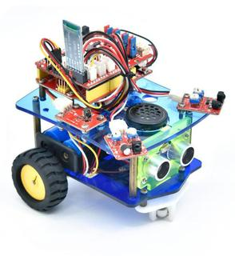

# 桌面迷你智能小车介绍

## 简介 

我们要让机器人听我们的话，就得给机器人下达指令，下指令时说人类的语言没有用，只能编写机器人能听懂的程序语言。

编程不仅对那些未来要当程序员的孩子有用，而且对其他孩子也有很大的作用。编程就是把大问题分割成小问题，然后解决问题的过程，对孩子的逻辑分析能力，创造能力，动手能力，解决问题的能力有极大的提升。

今天给大家推荐一款桌面迷你编程智能车,这款智能车可以让孩子们轻松学习编程,并且获得有关电子，机械，控制逻辑和计算机科学的实践知识。

他是基于ARDUINO的开源机器人，他的安装和接线十分简单，组件都通过螺钉和铜柱连接，只需要几个简单的步骤就可以组装完成。他提供了18个编程的课程项目，由简单到复杂，一步一步，学习怎么去编写机器人能”听”懂的语言。

## 资料下载

[https://pan.baidu.com/s/1-ZNQc_2_XqD1QPp1AaXMlw](https://pan.baidu.com/s/1-ZNQc_2_XqD1QPp1AaXMlw)

提取码：ooiu

## 特点

1.功能多多：避障功能，跟随功能，红外遥控，蓝牙控制，循迹功能，演奏音乐等。

2.组装简单：无需焊接电路，只需几个简单的步骤即可组装该机器人。

3.结构坚固：构成车体的部分是优质亚克力材质，电机用是优质的N20金属电机。

4.扩展性强：配置了电机驱动扩展板，可以扩展其他的传感器和模块。

5.多种控制：红外遥控器控制，手机遥控控制（苹果和安卓手机都可）。

6.学习基础编程：使用Arduino IDE的C语言编程，可以接触底层代码。

## 参数

工作电压：5v

输入电压：7-12V

最大输出电流：1A

最大耗散功率：25W（T=75℃）

电机转速：5V 63 rpm / min

电机驱动形式：双路H桥驱动

超声波感应角度：\<15度

超声波探测距离：2cm-400cm

红外遥控距离：10米（实测）

蓝牙遥控距离：50米（实测）

蓝牙APP控制：支持Android和IOS系统

7.可接入外部DC 7~12V的电压。

## 清单

当收到这个智能车套件的时候，首先看到是一个包装精美的外盒，每个配件被安全且有序的装在外盒里面的小盒子里，先来清点一下：

|No|Product Name|Quantity|Picture|
|-|-|-|-|
|1|Keyes Uno Plus 开发板 红色环保|1|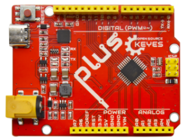|
|2|Keyes L298P 电机驱动扩展板|1|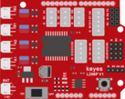|
|3|红外接收传感器|1|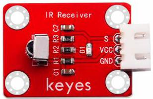|
|4|三路循迹传感器|1|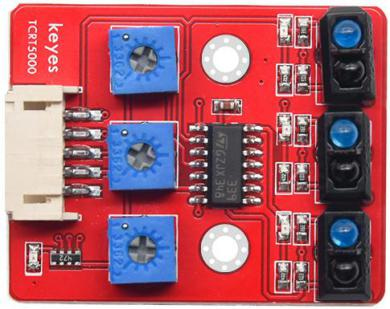|
|5|电机连接板A|1|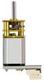|
|6|电机连接板B|1||
|7|避障传感器|2|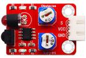|
|8|HC-SR04超声波传感器|1|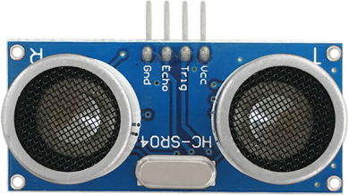|
|9|DX-BT24 蓝牙模块|1|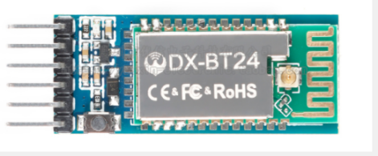|
|10|小功放声音模块|1|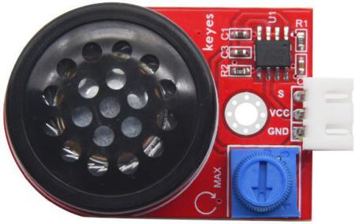|
|11|XH2.54转PH2.0 5P连接线|1|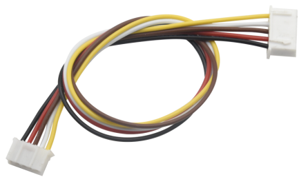|
|12|HX-2.54 4P 双头 连接线|1|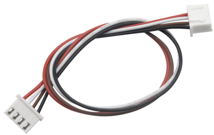|
|13|HX-2.54 3P 连接线|3||
|14|XH2.54-3Pin连接线|1|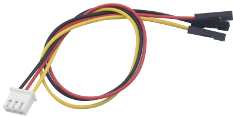|
|15|双头JST-PH2.0MM-2P 连接线|2||
|16|18650电池盒|1|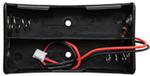|
|17|4节5号带线电池盒|1||
|18|M1.6*10MM 圆头 十字|6||
|19|M1.6 304 不锈钢|6||
|21|M2*10MM 圆头 十字|6|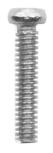|
|21|M2 镀镍|6||
|22|M3*12MM 圆头 十字|10|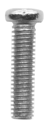|
|23|M3*6MM 圆头|24||
|24|M3*10MM 平头|4||
|25|M3 镀镍|25||
|26|M2 304 平垫|6||
|27|双通M3*40MM|4||
|28|单通 M3*5+6MM|2||
|29|双通M3*10MM|4||
|30|单通M3*8+6MM|2||
|31|橡胶轮子|2|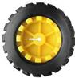|
|32|N20电机 支架|2||
|33|智能车亚克力板 蓝色透明2片 黄色透明1片 厚度3MM|1|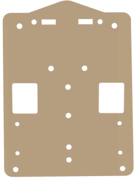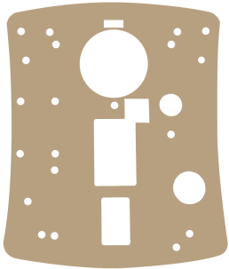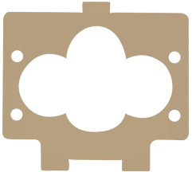|
|34|螺丝刀|1||
|35|USB线|1||
|36|W420钢珠万向轮|1|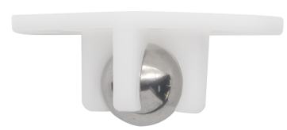|
|37|遥控器|1|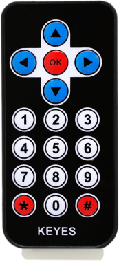|
|38|草帽LED|1|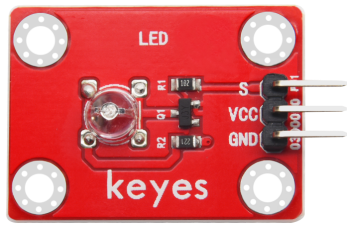|
|39|3Pin 双母头杜邦线|2|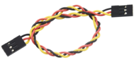|
|40|黑色 扎带|6||
|41|螺丝刀|1||